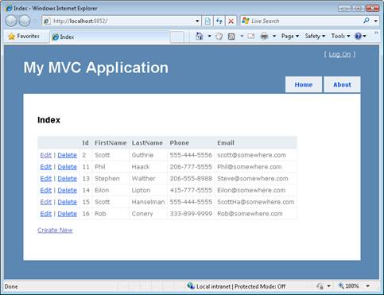
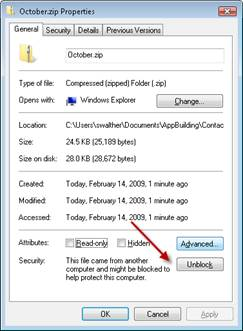
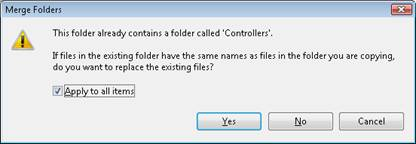
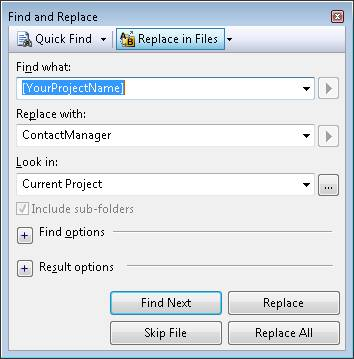
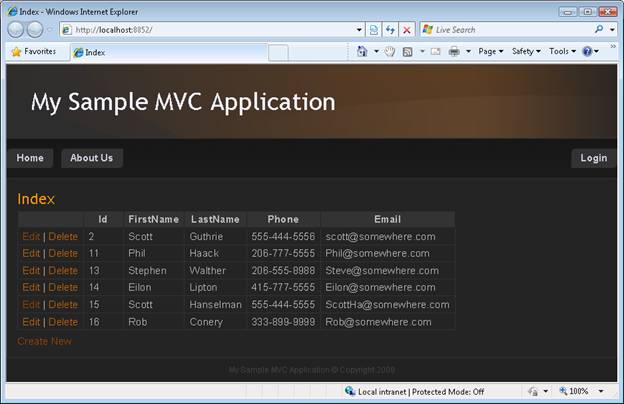
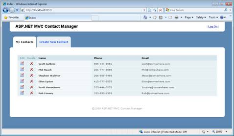

Iteration #2 – Make the application look nice (C#)
====================
by [Microsoft](https://github.com/microsoft)

[Download Code](iteration-2-make-the-application-look-nice-cs/_static/contactmanager_2_cs1.zip)

> In this iteration, we improve the appearance of the application by modifying the default ASP.NET MVC view master page and cascading style sheet.

## Building a Contact Management ASP.NET MVC Application (C#)
  

In this series of tutorials, we build an entire Contact Management application from start to finish. The Contact Manager application enables you to store contact information - names, phone numbers and email addresses - for a list of people.

We build the application over multiple iterations. With each iteration, we gradually improve the application. The goal of this multiple iteration approach is to enable you to understand the reason for each change.

- Iteration #1 - Create the application. In the first iteration, we create the Contact Manager in the simplest way possible. We add support for basic database operations: Create, Read, Update, and Delete (CRUD).

- Iteration #2 - Make the application look nice. In this iteration, we improve the appearance of the application by modifying the default ASP.NET MVC view master page and cascading style sheet.

- Iteration #3 - Add form validation. In the third iteration, we add basic form validation. We prevent people from submitting a form without completing required form fields. We also validate email addresses and phone numbers.

- Iteration #4 - Make the application loosely coupled. In this third iteration, we take advantage of several software design patterns to make it easier to maintain and modify the Contact Manager application. For example, we refactor our application to use the Repository pattern and the Dependency Injection pattern.

- Iteration #5 - Create unit tests. In the fifth iteration, we make our application easier to maintain and modify by adding unit tests. We mock our data model classes and build unit tests for our controllers and validation logic.

- Iteration #6 - Use test-driven development. In this sixth iteration, we add new functionality to our application by writing unit tests first and writing code against the unit tests. In this iteration, we add contact groups.

- Iteration #7 - Add Ajax functionality. In the seventh iteration, we improve the responsiveness and performance of our application by adding support for Ajax.

## This Iteration

The goal of this iteration is to improve the appearance of the Contact Manager application. Currently, the Contact Manager uses the default ASP.NET MVC view master page and cascading style sheet (see Figure 1). These don t look bad, but I don t want the Contact Manager to look just like every other ASP.NET MVC website. I want to replace these files with custom files.

**Figure 01**: The default appearance of an ASP.NET MVC Application ([Click to view full-size image](iteration-2-make-the-application-look-nice-cs/_static/image2.png))

In this iteration, I discuss two approaches to improving the visual design of our application. First, I show you how to take advantage of the ASP.NET MVC Design gallery to download a free ASP.NET MVC design template. The ASP.NET MVC Design gallery enables you to create a professional web application without doing any work.

I decided to not use a template from the ASP.NET MVC Design gallery for the Contact Manager application. Instead, I had a custom design created by a professional design firm. In the second part of this tutorial, I explain how I worked with a professional design company to create the final ASP.NET MVC design.

## The ASP.NET MVC Design Gallery

The ASP.NET MVC Design Gallery is a free resource provided by Microsoft. The ASP.NET MVC Gallery is located at the following address:

[https://www.asp.net/mvc/gallery](https://www.asp.net/mvc/gallery)

The ASP.NET MVC Design Gallery hosts a collection of free website designs that were created specifically for using in an ASP.NET MVC project. Designs are uploaded by members of the community. Visitors to the Gallery can vote for their favorite designs (see Figure 2).

**Figure 02**: The ASP.NET MVC Design Gallery ([Click to view full-size image](iteration-2-make-the-application-look-nice-cs/_static/image4.png))

As I write this tutorial, the most popular design in the gallery is a design named October by David Hauser. You can use this design for an ASP.NET MVC project by completing the following steps:

1. Click the **Download** button to download the October.zip file to your computer.
2. Right-click the downloaded October.zip file and click the **Unblock** button (see Figure 3).
3. Unzip the file to a folder named October.
4. Select all of the files from the DesignTemplate folder contained in the October folder, right-click the files, and select the menu option **Copy**.
5. Right-click the ContactManager project node in the Visual Studio Solution Explorer window and select the menu option **Paste** (see Figure 4).
6. Select the Visual Studio menu option **Edit, Find and Replace, Quick Replace** and replace *[MyProjectName]* with *ContactManager* (see Figure 5).

**Figure 03**: Unblocking a file downloaded from the web ([Click to view full-size image](iteration-2-make-the-application-look-nice-cs/_static/image6.png))

**Figure 04**: Overwriting files in the Solution Explorer ([Click to view full-size image](iteration-2-make-the-application-look-nice-cs/_static/image8.png))

**Figure 05**: Replacing [ProjectName] with ContactManager ([Click to view full-size image](iteration-2-make-the-application-look-nice-cs/_static/image10.png))

After you complete these steps, your web application will use the new design. The page in Figure 6 illustrates the appearance of the Contact Manager application with the October design.

**Figure 06**: ContactManager with the October template ([Click to view full-size image](iteration-2-make-the-application-look-nice-cs/_static/image12.png))

## Creating a Custom ASP.NET MVC Design

The ASP.NET MVC Design Gallery has a good selection of different design styles. The Gallery provides you with a painless way to customize the appearance of your ASP.NET MVC applications. And, of course, the Gallery has the big advantage of being completely free.

However, you might need to create a completely unique design for your website. In that case, it makes sense to work with a website design company. I decided to take this approach for the design for the Contact Manager application.

I zipped up the Contact Manager from Iteration #1 and sent the project to the design company. They did not own Visual Studio (shame on them!), but that didn t present a problem. They were able to download Microsoft Visual Web Developer for free from the [https://www.asp.net](https://www.asp.net) website and open the Contact Manager application in Visual Web Developer. In a couple of days, they had produced the design in Figure 7.

**Figure 07**: The ASP.NET MVC Contact Manager Design ([Click to view full-size image](iteration-2-make-the-application-look-nice-cs/_static/image14.png))

The new design consisted of two main files: a new cascading style sheet file and a new view master page file. A view master page contains the layout and shared content for views in an ASP.NET MVC application. For example, the view master page includes the header, navigation tabs, and footer that appear in Figure 7. I overwrote the existing Site.Master view master page in the Views\Shared folder with the new Site.Master file from the design company,

The design company also created a new cascading style sheet and set of images. I placed these new files in the Content folder and overwrote the existing Site.css file. You should place all static content in the Content folder.

Notice that the new design for the Contact Manager includes images for editing and deleting contacts. An Edit and Delete image appear next to each contact in the HTML table of contacts.

Originally, these links that were rendered with the HTML.ActionLink() helper like this:

[!code-aspx[Main](iteration-2-make-the-application-look-nice-cs/samples/sample1.aspx)]

The Html.ActionLink() method does not support images (the method HTML encodes the link text for security reasons). Therefore, I replaced the calls to Html.ActionLink() with calls to Url.Action() like this:

[!code-aspx[Main](iteration-2-make-the-application-look-nice-cs/samples/sample2.aspx)]

The Html.ActionLink() method renders an entire HTML hyperlink. The Url.Action() method, on the other hand, renders just the URL without the &lt;a&gt; tag.

Notice, furthermore, that the new design includes both selected and unselected tabs. For example, in Figure 8, the **Create New Contact** tab is selected and the **My Contacts** tab is not selected.

**Figure 08**: Selected and unselected tabs([Click to view full-size image](iteration-2-make-the-application-look-nice-cs/_static/image16.png))

To support rendering both selected and unselected tabs, I created a custom HTML helper named the MenuItemHelper. This helper method renders either a &lt;li&gt; tag or a &lt;li class="selected"&gt; tag depending on whether the current controller and action corresponds to the controller and action name passed to the helper. The code for the MenuItemHelper is contained in Listing 1.

**Listing 1 - Helpers\MenuItemHelper.cs**

[!code-csharp[Main](iteration-2-make-the-application-look-nice-cs/samples/sample3.cs)]

The MenuItemHelper uses the TagBuilder class internally to build the &lt;li&gt; HTML tag. The TagBuilder class is a very useful utility class that you can use whenever you need to build up a new HTML tag. It includes methods for adding attributes, adding CSS classes, generating Ids, and modifying the tag s inner HTML.

## Summary

In this iteration, we improved the visual design of our ASP.NET MVC application. First, you were introduced to the ASP.NET MVC Design Gallery. You learned how to download free design templates from the ASP.NET MVC Design Gallery that you can use in your ASP.NET MVC applications.

Next, we discussed how you can create a custom design by modifying the default cascading style sheet file and master view page file. In order to support the new design, we had to make some minor changes to our Contact Manager application. For example, we added a new HTML helper named the MenuItemHelper that displays selected and unselected tabs.

In the next iteration, we tackle the very important subject of validation. We add validation code to our application so that a user cannot create a new contact without supplying required values such as a person s first and last name.

> [!div class="step-by-step"]
> [Previous](iteration-1-create-the-application-cs.md)
> [Next](iteration-3-add-form-validation-cs.md)
