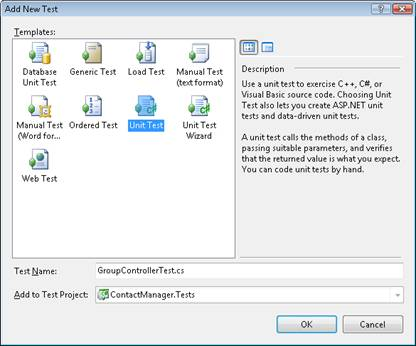
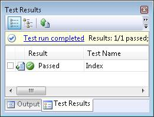
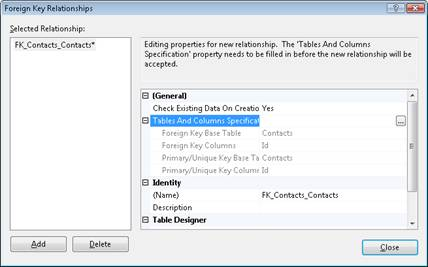
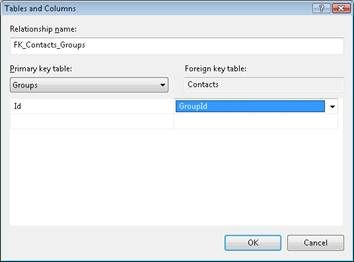
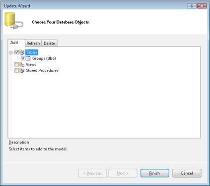
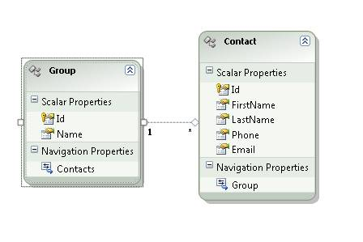
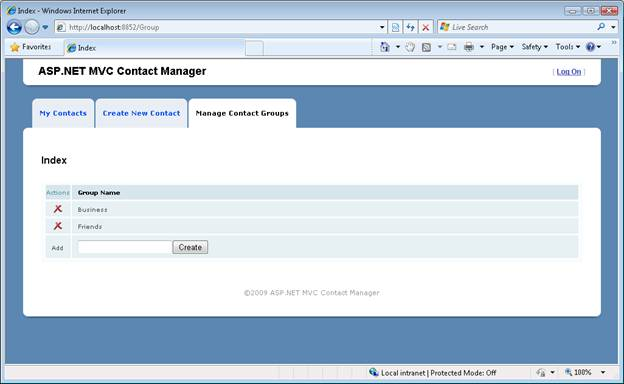
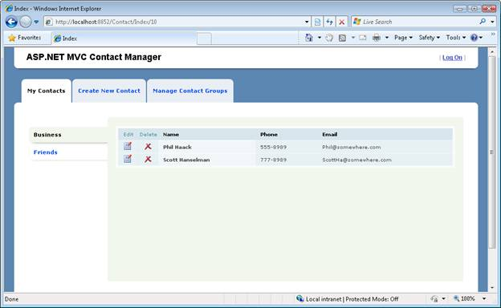

Iteration #6 – Use test-driven development (VB)
====================
by [Microsoft](https://github.com/microsoft)

[Download Code](iteration-6-use-test-driven-development-vb/_static/contactmanager_6_vb1.zip)

> In this sixth iteration, we add new functionality to our application by writing unit tests first and writing code against the unit tests. In this iteration, we add contact groups.

## Building a Contact Management ASP.NET MVC Application (VB)
  

In this series of tutorials, we build an entire Contact Management application from start to finish. The Contact Manager application enables you to store contact information - names, phone numbers and email addresses - for a list of people.

We build the application over multiple iterations. With each iteration, we gradually improve the application. The goal of this multiple iteration approach is to enable you to understand the reason for each change.

- Iteration #1 - Create the application. In the first iteration, we create the Contact Manager in the simplest way possible. We add support for basic database operations: Create, Read, Update, and Delete (CRUD).

- Iteration #2 - Make the application look nice. In this iteration, we improve the appearance of the application by modifying the default ASP.NET MVC view master page and cascading style sheet.

- Iteration #3 - Add form validation. In the third iteration, we add basic form validation. We prevent people from submitting a form without completing required form fields. We also validate email addresses and phone numbers.

- Iteration #4 - Make the application loosely coupled. In this third iteration, we take advantage of several software design patterns to make it easier to maintain and modify the Contact Manager application. For example, we refactor our application to use the Repository pattern and the Dependency Injection pattern.

- Iteration #5 - Create unit tests. In the fifth iteration, we make our application easier to maintain and modify by adding unit tests. We mock our data model classes and build unit tests for our controllers and validation logic.

- Iteration #6 - Use test-driven development. In this sixth iteration, we add new functionality to our application by writing unit tests first and writing code against the unit tests. In this iteration, we add contact groups.

- Iteration #7 - Add Ajax functionality. In the seventh iteration, we improve the responsiveness and performance of our application by adding support for Ajax.

## This Iteration

In the previous iteration of the Contact Manager application, we created unit tests to provide a safety net for our code. The motivation for creating the unit tests was to make our code more resilient to change. With unit tests in place, we can happily make any change to our code and immediately know whether we have broken existing functionality.

In this iteration, we use unit tests for an entirely different purpose. In this iteration, we use unit tests as part of an application design philosophy called *test-driven development*. When you practice test-driven development, you write tests first and then write code against the tests.

More precisely, when practicing test-driven development, there are three steps that you complete when creating code (Red/ Green/Refactor):

1. Write a unit test that fails (Red)
2. Write code that passes the unit test (Green)
3. Refactor your code (Refactor)

First, you write the unit test. The unit test should express your intention for how you expect your code to behave. When you first create the unit test, the unit test should fail. The test should fail because you have not yet written any application code that satisfies the test.

Next, you write just enough code in order for the unit test to pass. The goal is to write the code in the laziest, sloppiest and fastest possible way. You should not waste time thinking about the architecture of your application. Instead, you should focus on writing the minimal amount of code necessary to satisfy the intention expressed by the unit test.

Finally, after you have written enough code, you can step back and consider the overall architecture of your application. In this step, you rewrite (refactor) your code by taking advantage of software design patterns -- such as the repository pattern -- so that your code is more maintainable. You can fearlessly rewrite your code in this step because your code is covered by unit tests.

There are many benefits that result from practicing test-driven development. First, test-driven development forces you to focus on code that actually needs to be written. Because you are constantly focused on just writing enough code to pass a particular test, you are prevented from wandering into the weeds and writing massive amounts of code that you will never use.

Second, a "test first" design methodology forces you to write code from the perspective of how your code will be used. In other words, when practicing test-driven development, you are constantly writing your tests from a user perspective. Therefore, test-driven development can result in cleaner and more understandable APIs.

Finally, test-driven development forces you to write unit tests as part of the normal process of writing an application. As a project deadline approaches, testing is typically the first thing that goes out the window. When practicing test-driven development, on the other hand, you are more likely to be virtuous about writing unit tests because test-driven development makes unit tests central to the process of building an application.

> [!NOTE] 
> 
> To learn more about test-driven development, I recommend that you read Michael Feathers book **Working Effectively with Legacy Code**.

In this iteration, we add a new feature to our Contact Manager application. We add support for Contact Groups. You can use Contact Groups to organize your contacts into categories such as Business and Friend groups.

We'll add this new functionality to our application by following a process of test-driven development. We'll write our unit tests first and we'll write all of our code against these tests.

## What Gets Tested

As we discussed in the previous iteration, you typically do not write unit tests for data access logic or view logic. You don t write unit tests for data access logic because accessing a database is a relatively slow operation. You don t write unit tests for view logic because accessing a view requires spinning up a web server which is a relatively slow operation. You shouldn t write a unit test unless the test can be executed over and over again very fast

Because test-driven development is driven by unit tests, we focus initially on writing controller and business logic. We avoid touching the database or views. We won t modify the database or create our views until the very end of this tutorial. We start with what can be tested.

## Creating User Stories

When practicing test-driven development, you always start by writing a test. This immediately raises the question: How do you decide what test to write first? To answer this question, you should write a set of [*user stories*](http://en.wikipedia.org/wiki/User_stories).

A user story is a very brief (usually one sentence) description of a software requirement. It should be a non-technical description of a requirement written from a user perspective.

Here s the set of user stories that describe the features required by the new Contact Group functionality:

1. User can view a list of contact groups.
2. User can create a new contact group.
3. User can delete an existing contact group.
4. User can select a contact group when creating a new contact.
5. User can select a contact group when editing an existing contact.
6. A list of contact groups is displayed in the Index view.
7. When a user clicks a contact group, a list of matching contacts is displayed.

Notice that this list of user stories is completely understandable by a customer. There is no mention of technical implementation details.

While in the process of building your application, the set of user stories can become more refined. You might break a user story into multiple stories (requirements). For example, you might decide that creating a new contact group should involve validation. Submitting a contact group without a name should return a validation error.

After you create a list of user stories, you are ready to write your first unit test. We'll start by creating a unit test for viewing the list of contact groups.

## Listing Contact Groups

Our first user story is that a user should be able to view a list of contact groups. We need to express this story with a test.

Create a new unit test by right-clicking the Controllers folder in the ContactManager.Tests project, selecting **Add, New Test**, and selecting the **Unit Test** template (see Figure 1). Name the new unit test GroupControllerTest.vb and click the **OK** button.

**Figure 01**: Adding the GroupControllerTest unit test([Click to view full-size image](iteration-6-use-test-driven-development-vb/_static/image2.png))

Our first unit test is contained in Listing 1. This test verifies that the Index() method of the Group controller returns a set of Groups. The test verifies that a collection of Groups is returned in view data.

**Listing 1 - Controllers\GroupControllerTest.vb**

[!code-vb[Main](iteration-6-use-test-driven-development-vb/samples/sample1.vb)]

When you first type the code in Listing 1 in Visual Studio, you'll get a lot of red squiggly lines. We have not created the GroupController or Group classes.

At this point, we can t even build our application so we can t execute our first unit test. That s good. That counts as a failing test. Therefore, we now have permission to start writing application code. We need to write enough code to execute our test.

The Group controller class in Listing 2 contains the bare minimum of code required to pass the unit test. The Index() action returns a statically coded list of Groups (the Group class is defined in Listing 3).

**Listing 2 - Controllers\GroupController.vb**

[!code-vb[Main](iteration-6-use-test-driven-development-vb/samples/sample2.vb)]

**Listing 3 - Models\Group.vb**

[!code-vb[Main](iteration-6-use-test-driven-development-vb/samples/sample3.vb)]

After we add the GroupController and Group classes to our project, our first unit test completes successfully (see Figure 2). We have done the minimum work required to pass the test. It is time to celebrate.

**Figure 02**: Success!([Click to view full-size image](iteration-6-use-test-driven-development-vb/_static/image4.png))

## Creating Contact Groups

Now we can move on to the second user story. We need to be able to create new contact groups. We need to express this intention with a test.

The test in Listing 4 verifies that calling the Create() method with a new Group adds the Group to the list of Groups returned by the Index() method. In other words, if I create a new group then I should be able to get the new Group back from the list of Groups returned by the Index() method.

**Listing 4 - Controllers\GroupControllerTest.vb**

[!code-vb[Main](iteration-6-use-test-driven-development-vb/samples/sample4.vb)]

The test in Listing 4 calls the Group controller Create() method with a new contact Group. Next, the test verifies that calling the Group controller Index() method returns the new Group in view data.

The modified Group controller in Listing 5 contains the bare minimum of changes required to pass the new test.

**Listing 5 - Controllers\GroupController.vb**

[!code-vb[Main](iteration-6-use-test-driven-development-vb/samples/sample5.vb)]

## The Group controller in Listing 5 has a new Create() action. This action adds a Group to a collection of Groups. Notice that the Index() action has been modified to return the contents of the collection of Groups.

Once again, we have performed the bare minimum amount of work required to pass the unit test. After we make these changes to the Group controller, all of our unit tests pass.

## Adding Validation

This requirement was not stated explicitly in the user story. However, it is reasonable to require that a Group have a name. Otherwise, organizing contacts into Groups would not be very useful.

Listing 6 contains a new test that expresses this intention. This test verifies that attempting to create a Group without supplying a name results in a validation error message in model state.

**Listing 6 - Controllers\GroupControllerTest.vb**

[!code-vb[Main](iteration-6-use-test-driven-development-vb/samples/sample6.vb)]

In order to satisfy this test, we need to add a Name property to our Group class (see Listing 7). Furthermore, we need to add a tiny bit of validation logic to our Group controller s Create() action (see Listing 8).

**Listing 7 - Models\Group.vb**

[!code-vb[Main](iteration-6-use-test-driven-development-vb/samples/sample7.vb)]

**Listing 8 - Controllers\GroupController.vb**

[!code-vb[Main](iteration-6-use-test-driven-development-vb/samples/sample8.vb)]

Notice that the Group controller Create() action now contains both validation and database logic. Currently, the database used by the Group controller consists of nothing more than an in-memory collection.

## Time to Refactor

The third step in Red/Green/Refactor is the Refactor part. At this point, we need to step back from our code and consider how we can refactor our application to improve its design. The Refactor stage is the stage at which we think hard about the best way of implementing software design principles and patterns.

We are free to modify our code in any way that we choose to improve the design of the code. We have a safety net of unit tests that prevent us from breaking existing functionality.

Right now, our Group controller is a mess from the perspective of good software design. The Group controller contains a tangled mess of validation and data access code. To avoid violating the Single Responsibility Principle, we need to separate these concerns into different classes.

Our refactored Group controller class is contained in Listing 9. The controller has been modified to use the ContactManager service layer. This is the same service layer that we use with the Contact controller.

Listing 10 contains the new methods added to the ContactManager service layer to support validating, listing, and creating groups. The IContactManagerService interface was updated to include the new methods.

Listing 11 contains a new FakeContactManagerRepository class that implements the IContactManagerRepository interface. Unlike the EntityContactManagerRepository class that also implements the IContactManagerRepository interface, our new FakeContactManagerRepository class does not communicate with the database. The FakeContactManagerRepository class uses an in-memory collection as a proxy for the database. We'll use this class in our unit tests as a fake repository layer.

**Listing 9 - Controllers\GroupController.vb**

[!code-vb[Main](iteration-6-use-test-driven-development-vb/samples/sample9.vb)]

**Listing 10 - Controllers\ContactManagerService.vb**

[!code-vb[Main](iteration-6-use-test-driven-development-vb/samples/sample10.vb)]

**Listing 11 - Controllers\FakeContactManagerRepository.vb**

[!code-vb[Main](iteration-6-use-test-driven-development-vb/samples/sample11.vb)]

Modifying the IContactManagerRepository interface requires use to implement the CreateGroup() and ListGroups() methods in the EntityContactManagerRepository class. The laziest and fastest way to do this is to add stub methods that look like this:

[!code-vb[Main](iteration-6-use-test-driven-development-vb/samples/sample12.vb)]

Finally, these changes to the design of our application require us to make some modifications to our unit tests. We now need to use the FakeContactManagerRepository when performing the unit tests. The updated GroupControllerTest class is contained in Listing 12.

**Listing 12 - Controllers\GroupControllerTest.vb**

[!code-vb[Main](iteration-6-use-test-driven-development-vb/samples/sample13.vb)]

After we make all of these changes, once again, all of our unit tests pass. We have completed the entire cycle of Red/Green/Refactor. We have implemented the first two user stories. We now have supporting unit tests for the requirements expressed in the user stories. Implementing the remainder of the user stories involves repeating the same cycle of Red/Green/Refactor.

## Modifying our Database

Unfortunately, even though we have satisfied all of the requirements expressed by our unit tests, our work is not done. We still need to modify our database.

We need to create a new Group database table. Follow these steps:

1. In the Server Explorer window, right-click the Tables folder and select the menu option **Add New Table**.
2. Enter the two columns described below in the Table Designer.
3. Mark the Id column as a primary key and Identity column.
4. Save the new table with the name Groups by clicking the icon of the floppy.

| **Column Name** | **Data Type** | **Allow Nulls** |
| --- | --- | --- |
| Id | int | False |
| Name | nvarchar(50) | False |

Next, we need to delete all of the data from the Contacts table (otherwise, we won t be able to create a relationship between the Contacts and Groups tables). Follow these steps:

1. Right-click the Contacts table and select the menu option **Show Table Data**.
2. Delete all of the rows.

Next, we need to define a relationship between the Groups database table and the existing Contacts database table. Follow these steps:

1. Double-click the Contacts table in the Server Explorer window to open the Table Designer.
2. Add a new integer column to the Contacts table named GroupId.
3. Click the Relationship button to open the Foreign Key Relationships dialog (see Figure 3).
4. Click the Add button.
5. Click the ellipsis button that appears next to the Table and Columns Specification button.
6. In the Tables and Columns dialog, select Groups as the primary key table and Id as the primary key column. Select Contacts as the foreign key table and GroupId as the foreign key column (see Figure 4). Click the OK button.
7. Under **INSERT and UPDATE Specification**, select the value **Cascade** for **Delete Rule**.
8. Click the Close button to close the Foreign Key Relationships dialog.
9. Click the Save button to save the changes to the Contacts table.

**Figure 03**: Creating a database table relationship ([Click to view full-size image](iteration-6-use-test-driven-development-vb/_static/image6.png))

**Figure 04**: Specifying table relationships([Click to view full-size image](iteration-6-use-test-driven-development-vb/_static/image8.png))

### Updating our Data Model

Next, we need to update our data model to represent the new database table. Follow these steps:

1. Double-click the ContactManagerModel.edmx file in the Models folder to open the Entity Designer.
2. Right-click the Designer surface and select the menu option **Update Model from Database**.
3. In the Update Wizard, select the Groups table and click the Finish button (see Figure 5).
4. Right-click the Groups entity and select the menu option **Rename**. Change the name of the *Groups* entity to *Group* (singular).
5. Right-click the Groups navigation property that appears at the bottom of the Contact entity. Change the name of the *Groups* navigation property to *Group* (singular).

**Figure 05**: Updating an Entity Framework model from the database([Click to view full-size image](iteration-6-use-test-driven-development-vb/_static/image10.png))

After you complete these steps, your data model will represent both the Contacts and Groups tables. The Entity Designer should show both entities (see Figure 6).

**Figure 06**: Entity Designer displaying Group and Contact([Click to view full-size image](iteration-6-use-test-driven-development-vb/_static/image12.png))

### Creating our Repository Classes

Next, we need to implement our repository class. Over the course of this iteration, we added several new methods to the IContactManagerRepository interface while writing code to satisfy our unit tests. The final version of the IContactManagerRepository interface is contained in Listing 14.

**Listing 14 - Models\IContactManagerRepository.vb**

[!code-vb[Main](iteration-6-use-test-driven-development-vb/samples/sample14.vb)]

We haven t actually implemented any of the methods related to working with contact groups in our real EntityContactManagerRepository class. Currently, the EntityContactManagerRepository class has stub methods for each of the contact group methods listed in the IContactManagerRepository interface. For example, the ListGroups() method currently looks like this:

[!code-vb[Main](iteration-6-use-test-driven-development-vb/samples/sample15.vb)]

The stub methods enabled us to compile our application and pass the unit tests. However, now it is time to actually implement these methods. The final version of the EntityContactManagerRepository class is contained in Listing 13.

**Listing 13 - Models\EntityContactManagerRepository.vb**

[!code-vb[Main](iteration-6-use-test-driven-development-vb/samples/sample16.vb)]

### Creating the Views

ASP.NET MVC application when you use the default ASP.NET view engine. So, you don t create views in response to a particular unit test. However, because an application would be useless without views, we can t complete this iteration without creating and modifying the views contained in the Contact Manager application.

We need to create the following new views for managing contact groups (see Figure 7):

- Views\Group\Index.aspx - Displays list of contact groups
- Views\Group\Delete.aspx - Displays confirmation form for deleting a contact group

**Figure 07**: The Group Index view([Click to view full-size image](iteration-6-use-test-driven-development-vb/_static/image14.png))

We need to modify the following existing views so that they include contact groups:

- Views\Home\Create.aspx
- Views\Home\Edit.aspx
- Views\Home\Index.aspx

You can see the modified views by looking at the Visual Studio application that accompanies this tutorial. For example, Figure 8 illustrates the Contact Index view.

**Figure 08**: The Contact Index view([Click to view full-size image](iteration-6-use-test-driven-development-vb/_static/image16.png))

## Summary

In this iteration, we added new functionality to our Contact Manager application by following a test-driven development application design methodology. We started by creating a set of user stories. We created a set of unit tests that corresponds to the requirements expressed by the user stories. Finally, we wrote just enough code to satisfy the requirements expressed by the unit tests.

After we finished writing enough code to satisfy the requirements expressed by the unit tests, we updated our database and views. We added a new Groups table to our database and updated our Entity Framework Data Model. We also created and modified a set of views.

In the next iteration -- the final iteration -- we rewrite our application to take advantage of Ajax. By taking advantage of Ajax, we'll improve the responsiveness and performance of the Contact Manager application.

> [!div class="step-by-step"]
> [Previous](iteration-5-create-unit-tests-vb.md)
> [Next](iteration-7-add-ajax-functionality-vb.md)
