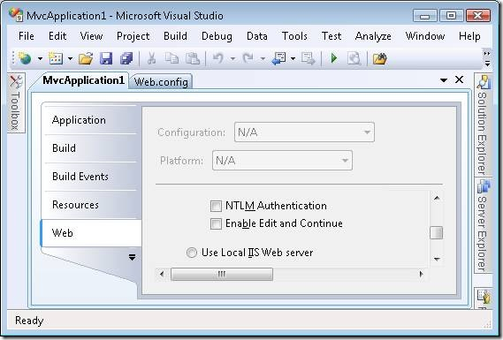
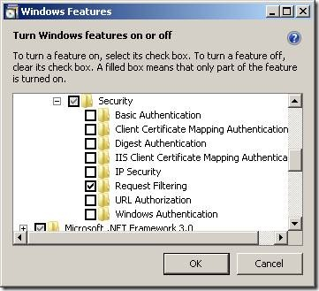
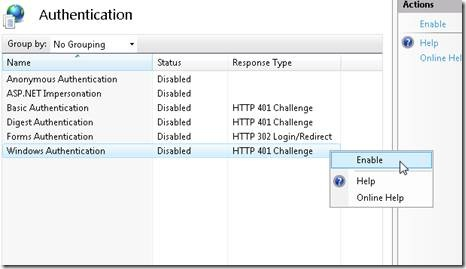
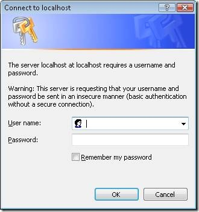

Authenticating Users with Windows Authentication (VB)
====================
by [Microsoft](https://github.com/microsoft)

> Learn how to use Windows authentication in the context of an MVC application. You learn how to enable Windows authentication within your application's web configuration file and how to configure authentication with IIS. Finally, you learn how to use the [Authorize] attribute to restrict access to controller actions to particular Windows users or groups.

The goal of this tutorial is to explain how you can take advantage of the security features built into Internet Information Services to password protect the views in your MVC applications. You learn how to allow controller actions to be invoked only by particular Windows users or users who are members of particular Windows groups.

Using Windows authentication makes sense when you are building an internal company website (an intranet site) and you want your users to be able to use their standard Windows user names and passwords when accessing the website. If you are building an outwards facing website (an Internet website) consider using Forms authentication instead.

#### Enabling Windows Authentication

When you create a new ASP.NET MVC application, Windows authentication is not enabled by default. Forms authentication is the default authentication type enabled for MVC applications. You must enable Windows authentication by modifying your MVC application's web configuration (web.config) file. Find the &lt;authentication&gt; section and modify it to use Windows instead of Forms authentication like this:

[!code-xml[Main](authenticating-users-with-windows-authentication-vb/samples/sample1.xml)]

When you enable Windows authentication, your web server becomes responsible for authenticating users. Typically, there are two different types of web servers that you use when creating and deploying an ASP.NET MVC application.

First, while developing an MVC application, you use the ASP.NET Development Web Server included with Visual Studio. By default, the ASP.NET Development Web Server executes all pages in the context of the current Windows account (whatever account you used to log into Windows).

The ASP.NET Development Web Server also supports NTLM authentication. You can enable NTLM authentication by right-clicking the name of your project in the Solution Explorer window and selecting Properties. Next, select the Web tab and check the NTLM checkbox (see Figure 1).

**Figure 1 – Enabling NTLM authentication for the ASP.NET Development Web Server**

For a production web application, on the hand, you use IIS as your web server. IIS supports several types of authentication including:

- Basic Authentication – Defined as part of the HTTP 1.0 protocol. Sends user names and passwords in clear text (Base64 encoded) across the Internet. - Digest Authentication – Sends a hash of a password, instead of the password itself, across the internet. - Integrated Windows (NTLM) Authentication – The best type of authentication to use in intranet environments using windows. - Certificate Authentication – Enables authentication using a client-side certificate. The certificate maps to a Windows user account.

> [!NOTE] 
> 
> For a more detailed overview of these different types of authentication, see [https://msdn.microsoft.com/library/aa292114(VS.71).aspx](https://msdn.microsoft.com/library/aa292114(VS.71).aspx).

You can use Internet Information Services Manager to enable a particular type of authentication. Be aware that all types of authentication are not available in the case of every operating system. Furthermore, if you are using IIS 7.0 with Windows Vista, you will need to enable the different types of Windows authentication before they appear in the Internet Information Services Manager. Open **Control Panel, Programs, Programs and Features, Turn Windows features on or off**, and expand the Internet Information Services node (see Figure 2).

**Figure 2 – Enabling Windows IIS features**

Using Internet Information Services, you can enable or disable different types of authentication. For example, Figure 3 illustrates disabling anonymous authentication and enabling Integrated Windows (NTLM) authentication when using IIS 7.0.

**Figure 3 – Enabling Integrated Windows Authentication**

#### Authorizing Windows Users and Groups

After you enable Windows authentication, you can use the &lt;Authorize&gt; attribute to control access to controllers or controller actions. This attribute can be applied to an entire MVC controller or a particular controller action.

For example, the Home controller in Listing 1 exposes three actions named Index(), CompanySecrets(), and StephenSecrets(). Anyone can invoke the Index() action. However, only members of the Windows local Managers group can invoke the CompanySecrets() action. Finally, only the Windows domain user named Stephen (in the Redmond domain) can invoke the StephenSecrets() action.

**Listing 1 – Controllers\HomeController.vb**

[!code-vb[Main](authenticating-users-with-windows-authentication-vb/samples/sample2.vb)]

> [!NOTE]
> Because of Windows User Account Control (UAC), when working with Windows Vista or Windows Server 2008, the local Administrators group will behave differently than other groups. The &lt;Authorize&gt; attribute won't correctly recognize a member of the local Administrators group unless you modify your computer's UAC settings.

Exactly what happens when you attempt to invoke a controller action without being the right permissions depends on the type of authentication enabled. By default, when using the ASP.NET Development Server, you simply get a blank page. The page is served with a **401 Not Authorized** HTTP Response Status.

If, on the other hand, you are using IIS with Anonymous authentication disabled and Basic authentication enabled, then you keep getting a login dialog prompt each time you request the protected page (see Figure 4).

**Figure 4 – Basic authentication login dialog**

#### Summary

This tutorial explained how you can use Windows authentication in the context of an ASP.NET MVC application. You learned how to enable Windows authentication within your application's web configuration file and how to configure authentication with IIS. Finally, you learned how to use the &lt;Authorize&gt; attribute to restrict access to controller actions to particular Windows users or groups.

> [!div class="step-by-step"]
> [Previous](authenticating-users-with-forms-authentication-vb.md)
> [Next](preventing-javascript-injection-attacks-vb.md)
