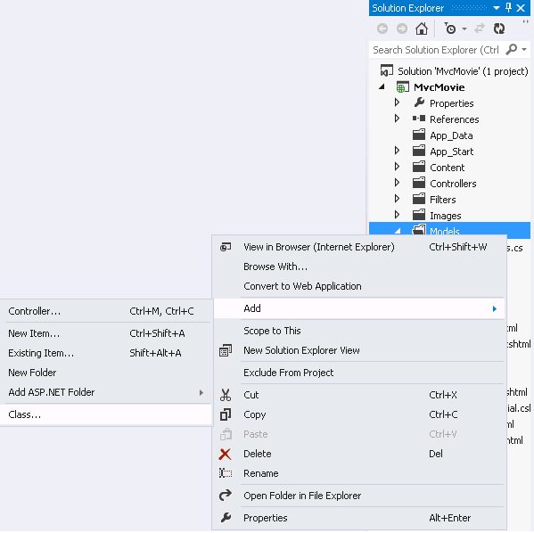
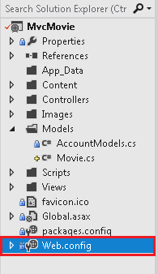

Adding a Model
====================
by [Rick Anderson](https://github.com/Rick-Anderson)

> > [!NOTE]
> > An updated version of this tutorial is available [here](../../getting-started/introduction/getting-started.md) that uses ASP.NET MVC 5 and Visual Studio 2013. It's more secure, much simpler to follow and demonstrates more features.

In this section you'll add some classes for managing movies in a database. These classes will be the &quot;model&quot; part of the ASP.NET MVC application.

You'll use a .NET Framework data-access technology known as the [Entity Framework](https://msdn.microsoft.com/library/bb399572(VS.110).aspx) to define and work with these model classes. The Entity Framework (often referred to as EF) supports a development paradigm called *Code First*. Code First allows you to create model objects by writing simple classes. (These are also known as POCO classes, from &quot;plain-old CLR objects.&quot;) You can then have the database created on the fly from your classes, which enables a very clean and rapid development workflow.

## Adding Model Classes

In **Solution Explorer**, right click the *Models* folder, select **Add**, and then select **Class**.

Enter the *class* name &quot;Movie&quot;.

Add the following five properties to the `Movie` class:

[!code-csharp[Main](adding-a-model/samples/sample1.cs)]

We'll use the `Movie` class to represent movies in a database. Each instance of a `Movie` object will correspond to a row within a database table, and each property of the `Movie` class will map to a column in the table.

In the same file, add the following `MovieDBContext` class:

[!code-csharp[Main](adding-a-model/samples/sample2.cs)]

The `MovieDBContext` class represents the Entity Framework movie database context, which handles fetching, storing, and updating `Movie` class instances in a database. The `MovieDBContext` derives from the `DbContext` base class provided by the Entity Framework.

In order to be able to reference `DbContext` and `DbSet`, you need to add the following `using` statement at the top of the file:

[!code-csharp[Main](adding-a-model/samples/sample3.cs)]

The complete *Movie.cs* file is shown below. (Several using statements that are not needed have been removed.)

[!code-csharp[Main](adding-a-model/samples/sample4.cs)]

## Creating a Connection String and Working with SQL Server LocalDB

The `MovieDBContext` class you created handles the task of connecting to the database and mapping `Movie` objects to database records. One question you might ask, though, is how to specify which database it will connect to. You'll do that by adding connection information in the *Web.config* file of the application.

Open the application root *Web.config* file. (Not the *Web.config* file in the *Views* folder.) Open the *Web.config* file outlined in red.

Add the following connection string to the `<connectionStrings>` element in the *Web.config* file.

[!code-xml[Main](adding-a-model/samples/sample5.xml)]

The following example shows a portion of the *Web.config* file with the new connection string added:

[!code-xml[Main](adding-a-model/samples/sample6.xml?highlight=6-9)]

This small amount of code and XML is everything you need to write in order to represent and store the movie data in a database.

Next, you'll build a new `MoviesController` class that you can use to display the movie data and allow users to create new movie listings.

> [!div class="step-by-step"]
> [Previous](adding-a-view.md)
> [Next](accessing-your-models-data-from-a-controller.md)
