# ASP.NET MVC 4 Entity Framework Scaffolding and Migrations

By [Web Camps Team](https://twitter.com/webcamps)

[Download Web Camps Training Kit](https://aka.ms/webcamps-training-kit)

If you are familiar with ASP.NET MVC 4 controller methods, or have completed the &quot;Helpers, Forms and Validation&quot; Hands-On lab, you should be aware that many of the logic to create, update, list and remove any data entity it is repeated among the application. Not to mention that, if your model has several classes to manipulate, you will be likely to spend a considerable time writing the POST and GET action methods for each entity operation, as well as each of the views.

In this lab you will learn how to use the ASP.NET MVC 4 scaffolding to automatically generate the baseline of your application's CRUD (Create, Read, Update and Delete). Starting from a simple model class, and, without writing a single line of code, you will create a controller that will contain all the CRUD operations, as well as the all the necessary views. After building and running the simple solution, you will have the application database generated, together with the MVC logic and views for data manipulation.

In addition, you will learn how easy it is to use Entity Framework Migrations to perform model updates throughout your entire application. Entity Framework Migrations will let you modify your database after the model has changed with simple steps. With all these in mind, you will be able to build and maintain web applications more efficiently, taking advantage of the latest features of ASP.NET MVC 4.

> [!NOTE]
> All sample code and snippets are included in the Web Camps Training Kit, available from at [Microsoft-Web/WebCampTrainingKit Releases](https://aka.ms/webcamps-training-kit). The project specific to this lab is available at [ASP.NET MVC 4 Entity Framework Scaffolding and Migrations](https://github.com/Microsoft-Web/HOL-EntityFrameworkScaffoldingAndMigrations).

### Objectives

In this Hands-On Lab, you will learn how to:

- Use ASP.NET scaffolding for CRUD operations in controllers.
- Change the database model using Entity Framework Migrations.

### Prerequisites

You must have the following items to complete this lab:

- [Microsoft Visual Studio Express 2012 for Web](https://www.microsoft.com/visualstudio/eng/products/visual-studio-express-for-web) or superior (read [Appendix A](#AppendixA) for instructions on how to install it).

### Setup

**Installing Code Snippets**

For convenience, much of the code you will be managing along this lab is available as Visual Studio code snippets. To install the code snippets run **.\Source\Setup\CodeSnippets.vsi** file.

If you are not familiar with the Visual Studio Code Snippets, and want to learn how to use them, you can refer to the appendix from this document &quot;[Appendix B: Using Code Snippets](#AppendixB)&quot;.

* * *

## Exercises

The following exercise make up this Hands-On Lab:

1. [Using ASP.NET MVC 4 Scaffolding with Entity Framework Migrations](#Exercise1)

> [!NOTE]
> This exercise is accompanied by an **End** folder containing the resulting solution you should obtain after completing the exercise. You can use this solution as a guide if you need additional help working through the exercise.

Estimated time to complete this lab: **30 minutes**

### Exercise 1: Using ASP.NET MVC 4 Scaffolding with Entity Framework Migrations

ASP.NET MVC scaffolding provides a quick way to generate the CRUD operations in a standardized way, creating the necessary logic that lets your application interact with the database layer.

In this exercise, you will learn how to use ASP.NET MVC 4 scaffolding with code first to create the CRUD methods. Then, you will learn how to update your model applying the changes in the database by using Entity Framework Migrations.

#### Task 1- Creating a new ASP.NET MVC 4 project using Scaffolding

1. If not already open, start **Visual Studio 2012**.
2. Select **File | New Project**. In the New Project dialog, under the **Visual C# | Web** section, select **ASP.NET MVC 4 Web Application**. Name the project to **MVC4andEFMigrations** and set the location to **Source\Ex1-UsingMVC4ScaffoldingEFMigrations** folder of this lab. Set the **Solution name** to **Begin** and ensure **Create directory for solution** is checked. Click **OK**.

    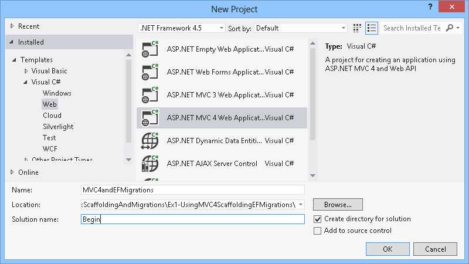

    *New ASP.NET MVC 4 Project Dialog Box*
3. In the **New ASP.NET MVC 4 Project** dialog box select the **Internet Application** template, and make sure that **Razor** is the selected **View engine**. Click **OK** to create the project.

    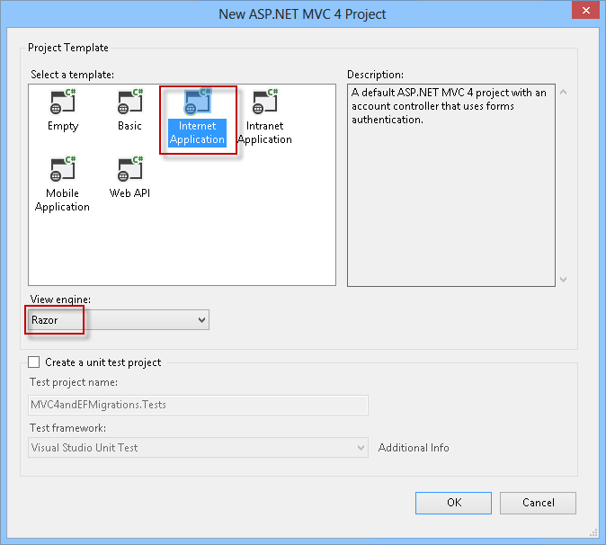

    *New ASP.NET MVC 4 Internet Application*
4. In the Solution Explorer, right-click **Models** and select **Add | Class** to create a simple class person (POCO). Name it **Person** and click **OK**.
5. Open the Person class and insert the following properties.

    (Code Snippet - *ASP.NET MVC 4 and Entity Framework Migrations - Ex1 Person Properties*)

    [!code-csharp[Main](aspnet-mvc-4-entity-framework-scaffolding-and-migrations/samples/sample1.cs)]
6. Click **Build | Build Solution** to save the changes and build the project.

    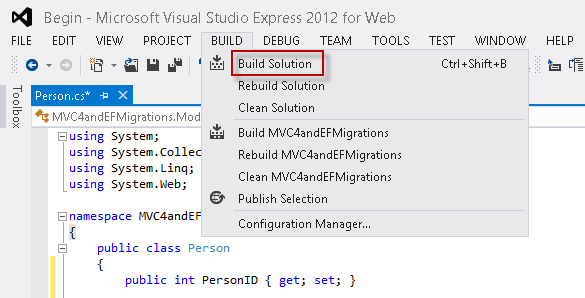

    *Building the Application*
7. In the Solution Explorer, right-click the controllers folder and select **Add | Controller**.
8. Name the controller *PersonController* and complete the **Scaffolding options** with the following values.

   1. In the **Template** drop-down list, select the **MVC controller with read/write actions and views, using Entity Framework** option.
   2. In the **Model class** drop-down list, select the **Person** class.
   3. In the **Data Context class** list, select **&lt;New data context...&gt;**. Choose any name and click **OK**.
   4. In the **Views** drop-down list, make sure that **Razor** is selected.

      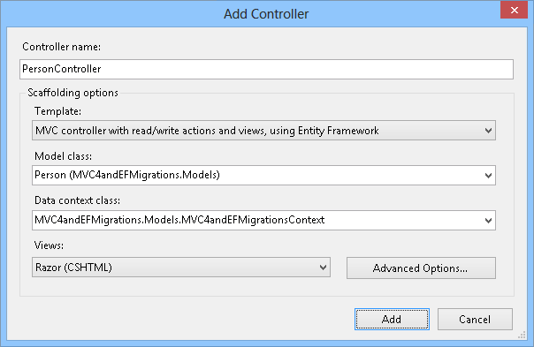

      *Adding the Person controller with scaffolding*
9. Click **Add** to create the new controller for Person with scaffolding. You have now generated the controller actions as well as the views.

    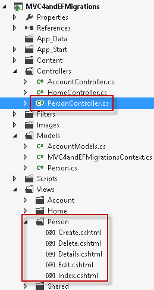

    *After creating the Person controller with scaffolding*
10. Open **PersonController** class. Notice that the full CRUD action methods have been generated automatically.

   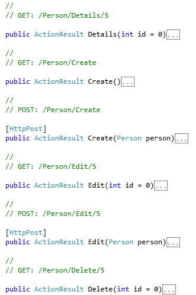

   *Inside the Person controller*

#### Task 2- Running the application

At this point, the database is not yet created. In this task, you will run the application for the first time and test the CRUD operations. The database will be created on the fly with Code First.

1. Press **F5** to run the application.
2. In the browser, add **/Person** to the URL to open the Person page.

    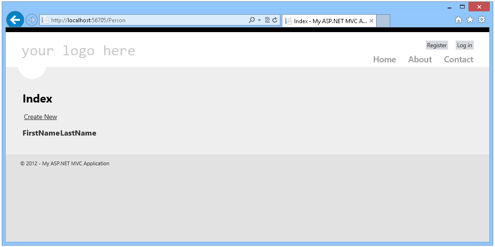

    *Application: first run*
3. You will now explore the Person pages and test the CRUD operations.

    1. Click **Create New** to add a new person. Enter a first name and a last name and click **Create**.

        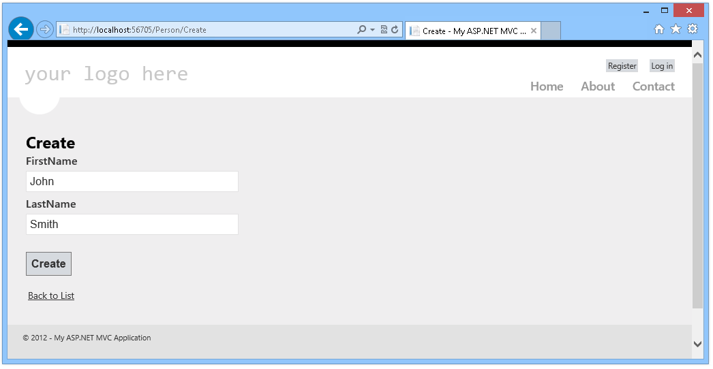

        *Adding a new person*
    2. In the person's list, you can delete, edit or add items.

        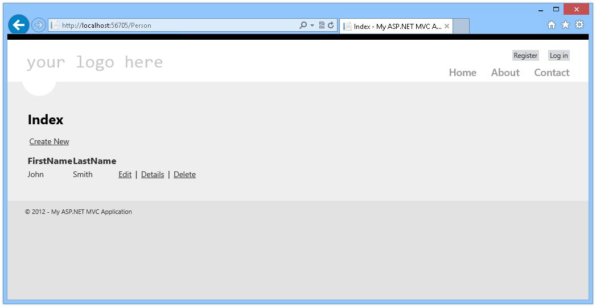

        *Person list*
    3. Click **Details** to open the person's details.

        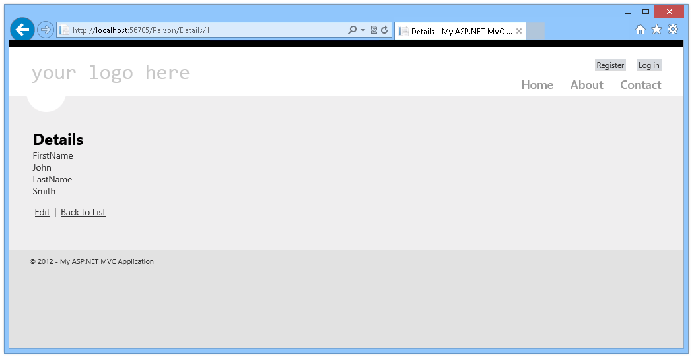

        *Person's details*
4. Close the browser and return to Visual Studio. Notice that you have created the whole CRUD for the person entity throughout your application -from the model to the views- without having to write a single line of code!

#### Task 3- Updating the database using Entity Framework Migrations

In this task you will update the database using Entity Framework Migrations. You will discover how easy it is to change the model and reflect the changes in your databases by using the Entity Framework Migrations feature.

1. Open the Package Manager Console. Select **Tools | Library Package Manager | Package Manager Console**.
2. In the Package Manager Console, enter the following command:

    PMC

    [!code-powershell[Main](aspnet-mvc-4-entity-framework-scaffolding-and-migrations/samples/sample2.ps1)]

    

    *Enabling migrations*

    The Enable-Migration command creates the **Migrations** folder, which contains a script to initialize the database.

    

    *Migrations folder*
3. Open the **Configuration.cs** file in the Migrations folder. Locate the class constructor and change the **AutomaticMigrationsEnabled** value to *true*.

    [!code-csharp[Main](aspnet-mvc-4-entity-framework-scaffolding-and-migrations/samples/sample3.cs)]
4. Open the Person class and add an attribute for the person's middle name. With this new attribute, you are changing the model.

    [!code-csharp[Main](aspnet-mvc-4-entity-framework-scaffolding-and-migrations/samples/sample4.cs)]
5. Select **Build | Build Solution** on the menu to build the application.

    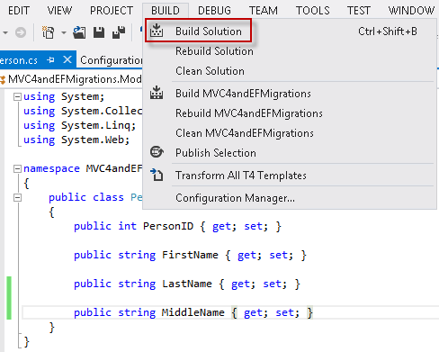

    *Building the application*
6. In the Package Manager Console, enter the following command:

    PMC

    [!code-powershell[Main](aspnet-mvc-4-entity-framework-scaffolding-and-migrations/samples/sample5.ps1)]

    This command will look for changes in the data objects, and then, it will add the necessary commands to modify the database accordingly.

    

    *Adding a middle name*
7. (Optional) You can run the following command to generate a SQL script with the differential update. This will let you update the database manually (In this case it's not necessary), or apply the changes in other databases:

    PMC

    [!code-powershell[Main](aspnet-mvc-4-entity-framework-scaffolding-and-migrations/samples/sample6.ps1)]

    

    *Generating a SQL script*

    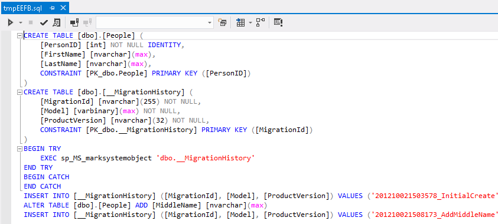

    *SQL Script update*
8. In the Package Manager Console, enter the following command to update the database:

    PMC

    [!code-powershell[Main](aspnet-mvc-4-entity-framework-scaffolding-and-migrations/samples/sample7.ps1)]

    

    *Updating the Database*

    This will add the **MiddleName** column in the **People** table to match the current definition of the **Person** class.
9. Once the database is updated, right-click the Controller folder and select **Add | Controller** to add the Person controller again (Complete with the same values). This will update the existing methods and views adding the new attribute.

    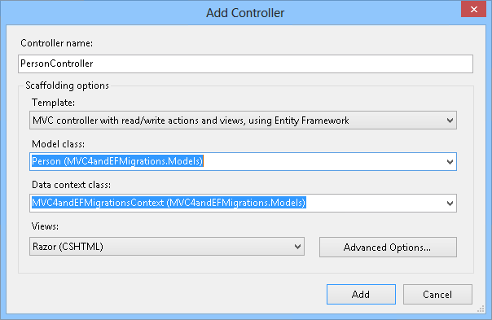

    *Updating the controller*
10. Click **Add**. Then, select the values **Overwrite PersonController.cs** and the **Overwrite associated views** and click **OK**.

   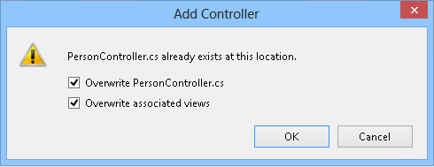

   *Updating the controller*

#### Task4- Running the application

1. Press **F5** to run the application.
2. Open **/Person**. Notice that the data was preserved, while the middle name column was added.

    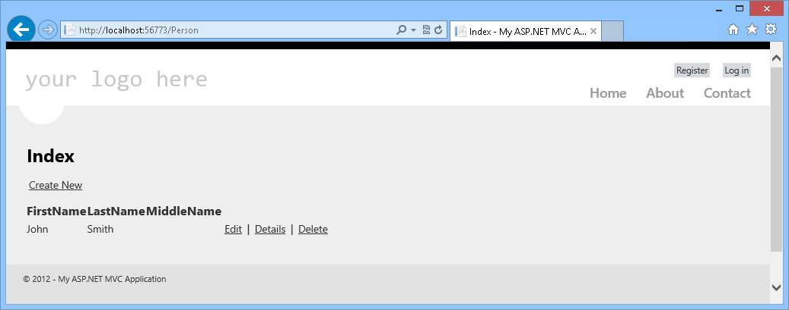

    *Middle Name added*
3. If you click **Edit**, you will be able to add a middle name to the current person.

    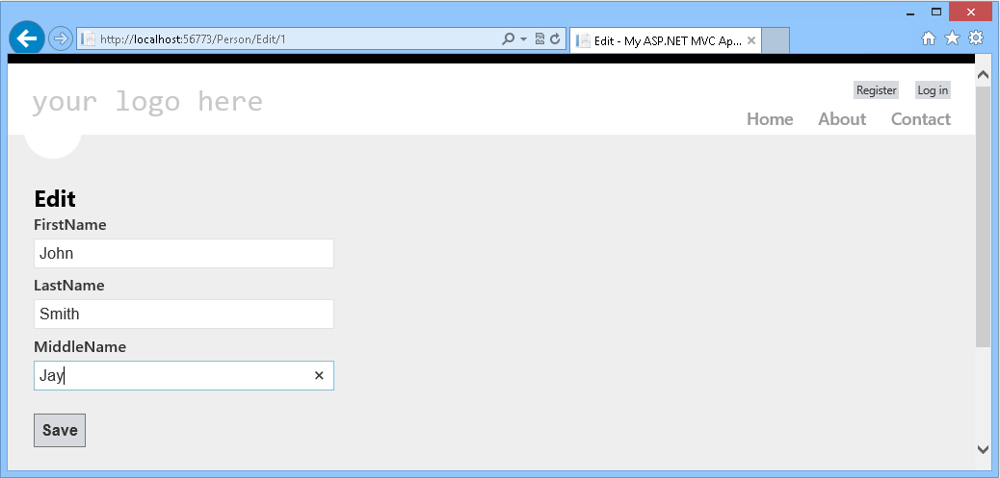

* * *

## Summary

In this Hands-On lab, you have learned simple steps to create CRUD operations with ASP.NET MVC 4 Scaffolding using any model class. Then, you have learned how to perform an end to end update in your application -from the database to the views- by using Entity Framework Migrations.

## Appendix A: Installing Visual Studio Express 2012 for Web

You can install **Microsoft Visual Studio Express 2012 for Web** or another &quot;Express&quot; version using the **[Microsoft Web Platform Installer](https://www.microsoft.com/web/downloads/platform.aspx)**. The following instructions guide you through the steps required to install *Visual studio Express 2012 for Web* using *Microsoft Web Platform Installer*.

1. Go to [[https://go.microsoft.com/? linkid=9810169](https://go.microsoft.com/?linkid=9810169)](https://go.microsoft.com/?linkid=9810169). Alternatively, if you already have installed Web Platform Installer, you can open it and search for the product &quot;<em>Visual Studio Express 2012 for Web with Windows Azure SDK</em>&quot;.
2. Click on **Install Now**. If you do not have **Web Platform Installer** you will be redirected to download and install it first.
3. Once **Web Platform Installer** is open, click **Install** to start the setup.

    

    *Install Visual Studio Express*
4. Read all the products' licenses and terms and click **I Accept** to continue.

    

    *Accepting the license terms*
5. Wait until the downloading and installation process completes.

    

    *Installation progress*
6. When the installation completes, click **Finish**.

    

    *Installation completed*
7. Click **Exit** to close Web Platform Installer.
8. To open Visual Studio Express for Web, go to the **Start** screen and start writing &quot;**VS Express**&quot;, then click on the **VS Express for Web** tile.

    

    *VS Express for Web tile*

## Appendix B: Using Code Snippets

With code snippets, you have all the code you need at your fingertips. The lab document will tell you exactly when you can use them, as shown in the following figure.

*Using Visual Studio code snippets to insert code into your project*

***To add a code snippet using the keyboard (C# only)***

1. Place the cursor where you would like to insert the code.
2. Start typing the snippet name (without spaces or hyphens).
3. Watch as IntelliSense displays matching snippets' names.
4. Select the correct snippet (or keep typing until the entire snippet's name is selected).
5. Press the Tab key twice to insert the snippet at the cursor location.

*Start typing the snippet name*

*Press Tab to select the highlighted snippet*

*Press Tab again and the snippet will expand*

***To add a code snippet using the mouse (C#, Visual Basic and XML)*** 1. Right-click where you want to insert the code snippet.

1. Select **Insert Snippet** followed by **My Code Snippets**.
2. Pick the relevant snippet from the list, by clicking on it.

*Right-click where you want to insert the code snippet and select Insert Snippet*

*Pick the relevant snippet from the list, by clicking on it*
