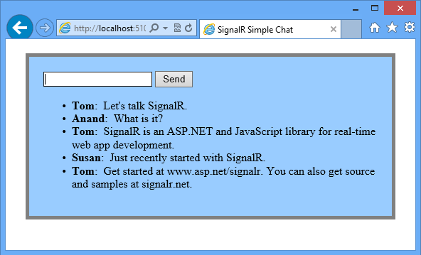
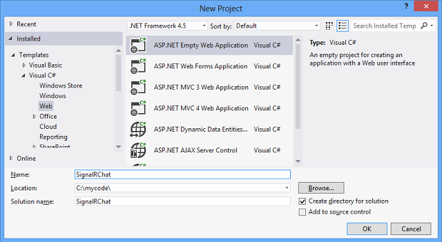
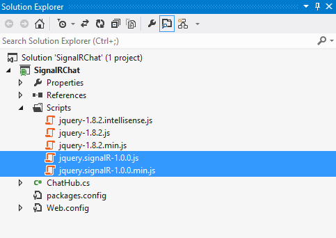
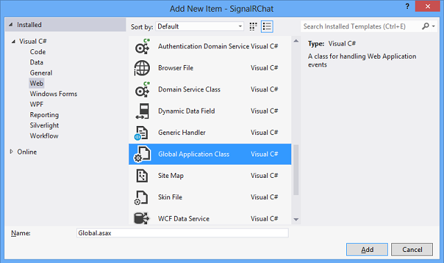
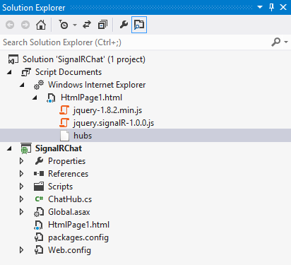

Tutorial: Getting Started with SignalR 1.x
====================
by [Patrick Fletcher](https://github.com/pfletcher), [Tim Teebken](https://github.com/timlt)

> This tutorial shows how to use SignalR to create a real-time chat application. You will add SignalR to an empty ASP.NET web application and create an HTML page to send and display messages.

## Overview

This tutorial introduces SignalR development by showing how to build a simple browser-based chat application. You will add the SignalR library to an empty ASP.NET web application, create a hub class for sending messages to clients, and create an HTML page that lets users send and receive chat messages. For a similar tutorial that shows how to create a chat application in MVC 4 using an MVC view, see [Getting Started with SignalR and MVC 4](index.md).

> [!NOTE]
> This tutorial uses the release (1.x) version of SignalR. For details on changes between SignalR 1.x and 2.0, see [Upgrading SignalR 1.x Projects](../releases/upgrading-signalr-1x-projects-to-20.md).

SignalR is an open-source .NET library for building web applications that require live user interaction or real-time data updates. Examples include social applications, multiuser games, business collaboration, and news, weather, or financial update applications. These are often called real-time applications.

SignalR simplifies the process of building real-time applications. It includes an ASP.NET server library and a JavaScript client library to make it easier to manage client-server connections and push content updates to clients. You can add the SignalR library to an existing ASP.NET application to gain real-time functionality.

The tutorial demonstrates the following SignalR development tasks:

- Adding the SignalR library to an ASP.NET web application.
- Creating a hub class to push content to clients.
- Using the SignalR jQuery library in a web page to send messages and display updates from the hub.

The following screen shot shows the chat application running in a browser. Each new user can post comments and see comments added after the user joins the chat.

Sections:

- [Set up the Project](#setup)
- [Run the Sample](#run)
- [Examine the Code](#code)
- [Next Steps](#next)

## Set up the Project

This section shows how to create an empty ASP.NET web application, add SignalR, and create the chat application.

Prerequisites:

- Visual Studio 2010 SP1 or 2012. If you do not have Visual Studio, see [ASP.NET Downloads](https://www.asp.net/downloads) to get the free Visual Studio 2012 Express Development Tool.
- [Microsoft ASP.NET and Web Tools 2012.2](https://go.microsoft.com/fwlink/?LinkId=279941). For Visual Studio 2012, this installer adds new ASP.NET features including SignalR templates to Visual Studio. For Visual Studio 2010 SP1, an installer is not available but you can complete the tutorial by installing the SignalR NuGet package as described in the setup steps.

The following steps use Visual Studio 2012 to create an ASP.NET Empty Web Application and add the SignalR library:

1. In Visual Studio create an ASP.NET Empty Web Application.

    
2. Open the **Package Manager Console** by selecting **Tools | Library Package Manager | Package Manager Console**. Enter the following command into the console window:

    `Install-Package Microsoft.AspNet.SignalR -Version 1.1.3`

    This command installs the latest version of SignalR 1.x.
3. In **Solution Explorer**, right-click the project, select **Add | Class**. Name the new class **ChatHub**.
4. In **Solution Explorer** expand the Scripts node. Script libraries for jQuery and SignalR are visible in the project.

    
5. Replace the code in the **ChatHub** class with the following code.

    [!code-csharp[Main](tutorial-getting-started-with-signalr/samples/sample1.cs)]
6. In **Solution Explorer**, right-click the project, then click **Add | New Item**. In the **Add New Item** dialog, select **Global Application Class** and click **Add**.

    
7. Add the following `using` statements after the provided `using` statements in the Global.asax.cs class.

    [!code-csharp[Main](tutorial-getting-started-with-signalr/samples/sample2.cs)]
8. Add the following line of code in the `Application_Start` method of the Global class to register the default route for SignalR hubs.

    [!code-csharp[Main](tutorial-getting-started-with-signalr/samples/sample3.cs)]
9. In **Solution Explorer**, right-click the project, then click **Add | New Item**. In the **Add New Item** dialog, select Html Page and click **Add**.
10. In **Solution Explorer**, right-click the HTML page you just created and click **Set as Start Page**.
11. Replace the default code in the HTML page with the following code.

    [!code-html[Main](tutorial-getting-started-with-signalr/samples/sample4.html)]
12. **Save All** for the project.

## Run the Sample

1. Press F5 to run the project in debug mode. The HTML page loads in a browser instance and prompts for a user name.

    
2. Enter a user name.
3. Copy the URL from the address line of the browser and use it to open two more browser instances. In each browser instance, enter a unique user name.
4. In each browser instance, add a comment and click **Send**. The comments should display in all browser instances.

    > [!NOTE]
    > This simple chat application does not maintain the discussion context on the server. The hub broadcasts comments to all current users. Users who join the chat later will see messages added from the time they join.

    The following screen shot shows the chat application running in three browser instances, all of which are updated when one instance sends a message:

    
5. In **Solution Explorer**, inspect the **Script Documents** node for the running application. There is a script file named **hubs** that the SignalR library dynamically generates at runtime. This file manages the communication between jQuery script and server-side code.

    

## Examine the Code

The SignalR chat application demonstrates two basic SignalR development tasks: creating a hub as the main coordination object on the server, and using the SignalR jQuery library to send and receive messages.

### SignalR Hubs

In the code sample the **ChatHub** class derives from the **Microsoft.AspNet.SignalR.Hub** class. Deriving from the **Hub** class is a useful way to build a SignalR application. You can create public methods on your hub class and then access those methods by calling them from jQuery scripts in a web page.

In the chat code, clients call the **ChatHub.Send** method to send a new message. The hub in turn sends the message to all clients by calling **Clients.All.broadcastMessage**.

The **Send** method demonstrates several hub concepts :

- Declare public methods on a hub so that clients can call them.
- Use the **Microsoft.AspNet.SignalR.Hub.Clients** dynamic property to access all clients connected to this hub.
- Call a jQuery function on the client (such as the `broadcastMessage` function) to update clients.

    [!code-csharp[Main](tutorial-getting-started-with-signalr/samples/sample5.cs)]

### SignalR and jQuery

The HTML page in the code sample shows how to use the SignalR jQuery library to communicate with a SignalR hub. The essential tasks in the code are declaring a proxy to reference the hub, declaring a function that the server can call to push content to clients, and starting a connection to send messages to the hub.

The following code declares a proxy for a hub.

[!code-javascript[Main](tutorial-getting-started-with-signalr/samples/sample6.js)]

> [!NOTE]
> In jQuery the reference to the server class and its members is in camel case. The code sample references the C# **ChatHub** class in jQuery as **chatHub**.

The following code is how you create a callback function in the script. The hub class on the server calls this function to push content updates to each client. The two lines that HTML encode the content before displaying it are optional and show a simple way to prevent script injection.

[!code-html[Main](tutorial-getting-started-with-signalr/samples/sample7.html)]

The following code shows how to open a connection with the hub. The code starts the connection and then passes it a function to handle the click event on the **Send** button in the HTML page.

> [!NOTE]
> This approach insures that the connection is established before the event handler executes.

[!code-javascript[Main](tutorial-getting-started-with-signalr/samples/sample8.js)]

## Next Steps

You learned that SignalR is a framework for building real-time web applications. You also learned several SignalR development tasks: how to add SignalR to an ASP.NET application, how to create a hub class, and how to send and receive messages from the hub.

You can make the sample application in this tutorial or other SignalR applications available over the Internet by deploying them to a hosting provider. Microsoft offers free web hosting for up to 10 web sites in a free [Windows Azure trial account](https://www.windowsazure.com/pricing/free-trial/?WT.mc_id=A443DD604). For a walkthrough on how to deploy the sample SignalR application, see [Publish the SignalR Getting Started Sample as a Windows Azure Web Site](https://blogs.msdn.com/b/timlee/archive/2013/02/27/deploy-the-signalr-getting-started-sample-as-a-windows-azure-web-site.aspx). For detailed information about how to deploy a Visual Studio web project to a Windows Azure Web Site, see [Deploying an ASP.NET Application to a Windows Azure Web Site](https://docs.microsoft.com/azure/app-service-web/app-service-web-get-started-dotnet). (Note: The WebSocket transport is not currently supported for Windows Azure Web Sites. When WebSocket transport is not available, SignalR uses the other available transports as described in the Transports section of the [Introduction to SignalR topic](index.md).)

To learn more advanced SignalR developments concepts, visit the following sites for SignalR source code and resources:

- [SignalR Project](http://signalr.net)
- [SignalR Github and Samples](https://github.com/SignalR/SignalR)
- [SignalR Wiki](https://github.com/SignalR/SignalR/wiki)
