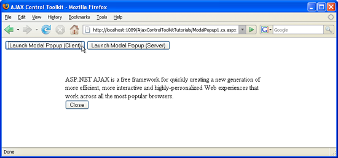

Launching a Modal Popup Window from Server Code (VB)
====================
by [Christian Wenz](https://github.com/wenz)

[Download Code](http://download.microsoft.com/download/2/4/0/24052038-f942-4336-905b-b60ae56f0dd5/ModalPopup1.vb.zip) or [Download PDF](http://download.microsoft.com/download/b/6/a/b6ae89ee-df69-4c87-9bfb-ad1eb2b23373/modalpopup1VB.pdf)

> The ModalPopup control in the AJAX Control Toolkit offers a simple way to create a modal popup using client-side means. However some scenarios require that the opening of the modal popup is triggered on the server-side.

## Overview

The ModalPopup control in the AJAX Control Toolkit offers a simple way to create a modal popup using client-side means. However some scenarios require that the opening of the modal popup is triggered on the server-side.

## Steps

First of all, an ASP.NET Button web control is required to demonstrate how the ModalPopup control works. Add such a button within the &lt;form&gt; element on a new page:

[!code-aspx[Main](launching-a-modal-popup-window-from-server-code-vb/samples/sample1.aspx)]

Then, you need the markup for the popup you want to create. Define it as an `<asp:Panel>` control and make sure that it includes a Button control. The ModalPopup control offers the functionality to make such a button close the popup; otherwise there is no easy way to let it vanish.

[!code-aspx[Main](launching-a-modal-popup-window-from-server-code-vb/samples/sample2.aspx)]

Next add the ModalPopup control from the ASP.NET AJAX Toolkit to the page. Set properties for the button which loads the control, the button which makes it disappear, and the ID of the actual popup.

[!code-aspx[Main](launching-a-modal-popup-window-from-server-code-vb/samples/sample3.aspx)]

As with all web pages based on ASP.NET AJAX; the Script Manager is required to load the necessary JavaScript libraries for the different target browsers:

[!code-aspx[Main](launching-a-modal-popup-window-from-server-code-vb/samples/sample4.aspx)]

Run the example in the browser. When you click on the button, the modal popup appears. In order to achieve the same effect using server-side code, a new button is required:

[!code-aspx[Main](launching-a-modal-popup-window-from-server-code-vb/samples/sample5.aspx)]

As you can see, a click on the button generates a postback and executes the `ServerButton_Click()` method on the server. In this method, a JavaScript function called `launchModal()` is executed to be exact, the JavaScript function will be executed once the page has been loaded:

[!code-aspx[Main](launching-a-modal-popup-window-from-server-code-vb/samples/sample6.aspx)]

The job of `launchModal()` is to display the ModalPopup. The `launchModal()` function is executed once the complete HTML page has been loaded. At that moment, however, the ASP.NET AJAX framework has not been fully loaded yet. Therefore, the `launchModal()` function just sets a variable that the ModalPopup control must be shown later on:

[!code-html[Main](launching-a-modal-popup-window-from-server-code-vb/samples/sample7.html)]

The `pageLoad()` JavaScript function is a special function that gets executed once ASP.NET AJAX has been fully loaded. Therefore we add code to this function to show the ModalPopup control, but only if `launchModal()` has been called before:

[!code-javascript[Main](launching-a-modal-popup-window-from-server-code-vb/samples/sample8.js)]

The `$find()` function is looking for a named element on the page and expects the server-side ID as a parameter. Therefore, `$find("mpe")` returns the client representation of the ModalPopup control; its `show()` method lets the popup appear.

The modal popup appears when either of the buttons is clicked ([Click to view full-size image](launching-a-modal-popup-window-from-server-code-vb/_static/image3.png))

> [!div class="step-by-step"]
> [Previous](positioning-a-modalpopup-cs.md)
> [Next](using-modalpopup-with-a-repeater-control-vb.md)
