Efficiently Paging Through Large Amounts of Data (C#)
====================
by [Scott Mitchell](https://twitter.com/ScottOnWriting)

[Download Sample App](http://download.microsoft.com/download/9/c/1/9c1d03ee-29ba-4d58-aa1a-f201dcc822ea/ASPNET_Data_Tutorial_25_CS.exe) or [Download PDF](efficiently-paging-through-large-amounts-of-data-cs/_static/datatutorial25cs1.pdf)

> The default paging option of a data presentation control is unsuitable when working with large amounts of data, as its underlying data source control retrieves all records, even though only a subset of data is displayed. In such circumstances, we must turn to custom paging.

## Introduction

As we discussed in the preceding tutorial, paging can be implemented in one of two ways:

- **Default Paging** can be implemented by simply checking the Enable Paging option in the data Web control s smart tag; however, whenever viewing a page of data, the ObjectDataSource retrieves *all* of the records, even though only a subset of them are displayed in the page
- **Custom Paging** improves the performance of default paging by retrieving only those records from the database that need to be displayed for the particular page of data requested by the user; however, custom paging involves a bit more effort to implement than default paging

Due to the ease of implementation just check a checkbox and you re done! default paging is an attractive option. Its na�ve approach in retrieving all of the records, though, makes it an implausible choice when paging through sufficiently large amounts of data or for sites with many concurrent users. In such circumstances, we must turn to custom paging in order to provide a responsive system.

The challenge of custom paging is being able to write a query that returns the precise set of records needed for a particular page of data. Fortunately, Microsoft SQL Server 2005 provides a new keyword for ranking results, which enables us to write a query that can efficiently retrieve the proper subset of records. In this tutorial we'll see how to use this new SQL Server 2005 keyword to implement custom paging in a GridView control. While the user interface for custom paging is identical to that for default paging, stepping from one page to the next using custom paging can be several orders of magnitude faster than default paging.

> [!NOTE]
> The exact performance gain exhibited by custom paging depends on the total number of records being paged through and the load being placed on the database server. At the end of this tutorial we'll look at some rough metrics that showcase the benefits in performance obtained through custom paging.

## Step 1: Understanding the Custom Paging Process

When paging through data, the precise records displayed in a page depend upon the page of data being requested and the number of records displayed per page. For example, imagine that we wanted to page through the 81 products, displaying 10 products per page. When viewing the first page, we d want products 1 through 10; when viewing the second page we d be interested in products 11 through 20, and so on.

There are three variables that dictate what records need to be retrieved and how the paging interface should be rendered:

- **Start Row Index** the index of the first row in the page of data to display; this index can be calculated by multiplying the page index by the records to display per page and adding one. For example, when paging through records 10 at a time, for the first page (whose page index is 0), the Start Row Index is 0 \* 10 + 1, or 1; for the second page (whose page index is 1), the Start Row Index is 1 \* 10 + 1, or 11.
- **Maximum Rows** the maximum number of records to display per page. This variable is referred to as maximum rows since for the last page there may be fewer records returned than the page size. For example, when paging through the 81 products 10 records per page, the ninth and final page will have just one record. No page, though, will show more records than the Maximum Rows value.
- **Total Record Count** the total number of records being paged through. While this variable isn t needed to determine what records to retrieve for a given page, it does dictate the paging interface. For example, if there are 81 products being paged through, the paging interface knows to display nine page numbers in the paging UI.

With default paging, the Start Row Index is computed as the product of the page index and the page size plus one, whereas the Maximum Rows is simply the page size. Since default paging retrieves all of the records from the database when rendering any page of data, the index for each row is known, thereby making moving to Start Row Index row a trivial task. Moreover, the Total Record Count is readily available, as it s simply the number of records in the DataTable (or whatever object is being used to hold the database results).

Given the Start Row Index and Maximum Rows variables, a custom paging implementation must only return the precise subset of records starting at the Start Row Index and up to Maximum Rows number of records after that. Custom paging provides two challenges:

- We must be able to efficiently associate a row index with each row in the entire data being paged through so that we can start returning records at the specified Start Row Index
- We need to provide the total number of records being paged through

In the next two steps we'll examine the SQL script needed to respond to these two challenges. In addition to the SQL script, we'll also need to implement methods in the DAL and BLL.

## Step 2: Returning the Total Number of Records Being Paged Through

Before we examine how to retrieve the precise subset of records for the page being displayed, let s first look at how to return the total number of records being paged through. This information is needed in order to properly configure the paging user interface. The total number of records returned by a particular SQL query can be obtained by using the [`COUNT` aggregate function](https://msdn.microsoft.com/library/ms175997.aspx). For example, to determine the total number of records in the `Products` table, we can use the following query:

[!code-sql[Main](efficiently-paging-through-large-amounts-of-data-cs/samples/sample1.sql)]

Let s add a method to our DAL that returns this information. In particular, we'll create a DAL method called `TotalNumberOfProducts()` that executes the `SELECT` statement shown above.

Start by opening the `Northwind.xsd` Typed DataSet file in the `App_Code/DAL` folder. Next, right-click on the `ProductsTableAdapter` in the Designer and choose Add Query. As we ve seen in previous tutorials, this will allow us to add a new method to the DAL that, when invoked, will execute a particular SQL statement or stored procedure. As with our TableAdapter methods in previous tutorials, for this one opt to use an ad-hoc SQL statement.

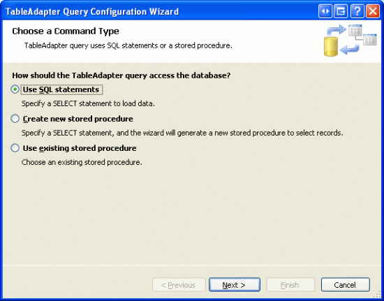

**Figure 1**: Use an Ad-Hoc SQL Statement

On the next screen we can specify what type of query to create. Since this query will return a single, scalar value the total number of records in the `Products` table choose the `SELECT` which returns a singe value option.

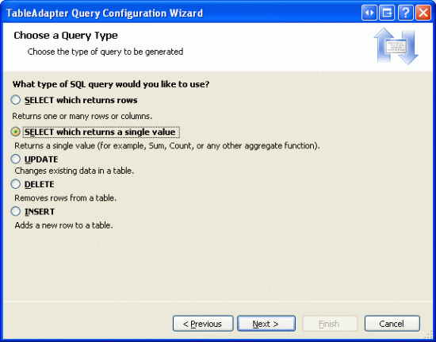

**Figure 2**: Configure the Query to Use a SELECT Statement that Returns a Single Value

After indicating the type of query to use, we must next specify the query.

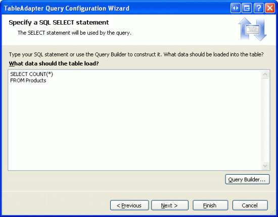

**Figure 3**: Use the SELECT COUNT(\*) FROM Products Query

Finally, specify the name for the method. As aforementioned, let s use `TotalNumberOfProducts`.

**Figure 4**: Name the DAL Method TotalNumberOfProducts

After clicking Finish, the wizard will add the `TotalNumberOfProducts` method to the DAL. The scalar returning methods in the DAL return nullable types, in case the result from the SQL query is `NULL`. Our `COUNT` query, however, will always return a non-`NULL` value; regardless, the DAL method returns a nullable integer.

In addition to the DAL method, we also need a method in the BLL. Open the `ProductsBLL` class file and add a `TotalNumberOfProducts` method that simply calls down to the DAL s `TotalNumberOfProducts` method:

[!code-csharp[Main](efficiently-paging-through-large-amounts-of-data-cs/samples/sample2.cs)]

The DAL s `TotalNumberOfProducts` method returns a nullable integer; however, we ve created the `ProductsBLL` class s `TotalNumberOfProducts` method so that it returns a standard integer. Therefore, we need to have the `ProductsBLL` class s `TotalNumberOfProducts` method return the value portion of the nullable integer returned by the DAL s `TotalNumberOfProducts` method. The call to `GetValueOrDefault()` returns the value of the nullable integer, if it exists; if the nullable integer is `null`, however, it returns the default integer value, 0.

## Step 3: Returning the Precise Subset of Records

Our next task is to create methods in the DAL and BLL that accept the Start Row Index and Maximum Rows variables discussed earlier and return the appropriate records. Before we do that, let s first look at the needed SQL script. The challenge facing us is that we must be able to efficiently assign an index to each row in the entire results being paged through so that we can return just those records starting at the Start Row Index (and up to the Maximum Records number of records).

This is not a challenge if there is already a column in the database table that serves as a row index. At first glance we might think that the `Products` table s `ProductID` field would suffice, as the first product has `ProductID` of 1, the second a 2, and so on. However, deleting a product leaves a gap in the sequence, nullifying this approach.

There are two general techniques used to efficiently associate a row index with the data to page through, thereby enabling the precise subset of records to be retrieved:

- **Using SQL Server 2005 s `ROW_NUMBER()` Keyword** new to SQL Server 2005, the `ROW_NUMBER()` keyword associates a ranking with each returned record based on some ordering. This ranking can be used as a row index for each row.
- **Using a Table Variable and `SET ROWCOUNT`** SQL Server s [`SET ROWCOUNT` statement](https://msdn.microsoft.com/library/ms188774.aspx) can be used to specify how many total records a query should process before terminating; [table variables](http://www.sqlteam.com/item.asp?ItemID=9454) are local T-SQL variables that can hold tabular data, akin to [temporary tables](http://www.sqlteam.com/item.asp?ItemID=2029). This approach works equally well with both Microsoft SQL Server 2005 and SQL Server 2000 (whereas the `ROW_NUMBER()` approach only works with SQL Server 2005).  
  
  The idea here is to create a table variable that has an `IDENTITY` column and columns for the primary keys of the table whose data is being paged through. Next, the contents of the table whose data is being paged through is dumped into the table variable, thereby associating a sequential row index (via the `IDENTITY` column) for each record in the table. Once the table variable has been populated, a `SELECT` statement on the table variable, joined with the underlying table, can be executed to pull out the particular records. The `SET ROWCOUNT` statement is used to intelligently limit the number of records that need to be dumped into the table variable.  
  
  This approach s efficiency is based on the page number being requested, as the `SET ROWCOUNT` value is assigned the value of Start Row Index plus the Maximum Rows. When paging through low-numbered pages such as the first few pages of data this approach is very efficient. However, it exhibits default paging-like performance when retrieving a page near the end.

This tutorial implements custom paging using the `ROW_NUMBER()` keyword. For more information on using the table variable and `SET ROWCOUNT` technique, see [A More Efficient Method for Paging Through Large Result Sets](http://www.4guysfromrolla.com/webtech/042606-1.shtml).

The `ROW_NUMBER()` keyword associated a ranking with each record returned over a particular ordering using the following syntax:

[!code-sql[Main](efficiently-paging-through-large-amounts-of-data-cs/samples/sample3.sql)]

`ROW_NUMBER()` returns a numerical value that specifies the rank for each record with regards to the indicated ordering. For example, to see the rank for each product, ordered from the most expensive to the least, we could use the following query:

[!code-sql[Main](efficiently-paging-through-large-amounts-of-data-cs/samples/sample4.sql)]

Figure 5 shows this query s results when run through the query window in Visual Studio. Note that the products are ordered by price, along with a price rank for each row.

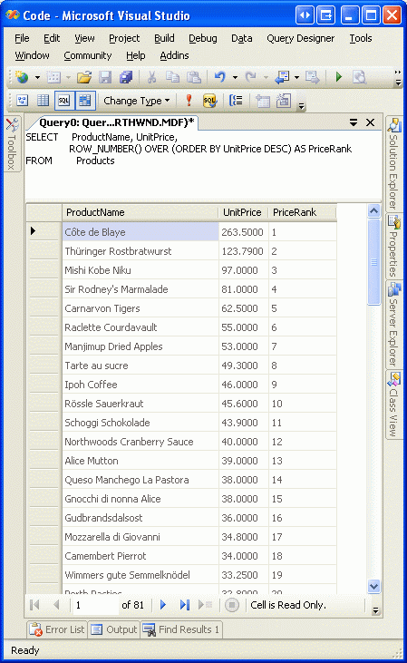

**Figure 5**: The Price Rank is Included for Each Returned Record

> [!NOTE]
> `ROW_NUMBER()` is just one of the many new ranking functions available in SQL Server 2005. For a more thorough discussion of `ROW_NUMBER()`, along with the other ranking functions, read [Returning Ranked Results with Microsoft SQL Server 2005](http://www.4guysfromrolla.com/webtech/010406-1.shtml).

When ranking the results by the specified `ORDER BY` column in the `OVER` clause (`UnitPrice`, in the above example), SQL Server must sort the results. This is a quick operation if there is a clustered index over the column(s) the results are being ordered by, or if there is a covering index, but can be more costly otherwise. To help improve performance for sufficiently large queries, consider adding a non-clustered index for the column by which the results are ordered by. See [Ranking Functions and Performance in SQL Server 2005](http://www.sql-server-performance.com/ak_ranking_functions.asp) for a more detailed look at the performance considerations.

The ranking information returned by `ROW_NUMBER()` cannot directly be used in the `WHERE` clause. However, a derived table can be used to return the `ROW_NUMBER()` result, which can then appear in the `WHERE` clause. For example, the following query uses a derived table to return the ProductName and UnitPrice columns, along with the `ROW_NUMBER()` result, and then uses a `WHERE` clause to only return those products whose price rank is between 11 and 20:

[!code-sql[Main](efficiently-paging-through-large-amounts-of-data-cs/samples/sample5.sql)]

Extending this concept a bit further, we can utilize this approach to retrieve a specific page of data given the desired Start Row Index and Maximum Rows values:

[!code-html[Main](efficiently-paging-through-large-amounts-of-data-cs/samples/sample6.html)]

> [!NOTE]
> As we will see later on in this tutorial, the *`StartRowIndex`* supplied by the ObjectDataSource is indexed starting at zero, whereas the `ROW_NUMBER()` value returned by SQL Server 2005 is indexed starting at 1. Therefore, the `WHERE` clause returns those records where `PriceRank` is strictly greater than *`StartRowIndex`* and less than or equal to *`StartRowIndex`* + *`MaximumRows`*.

Now that we ve discussed how `ROW_NUMBER()` can be used to retrieve a particular page of data given the Start Row Index and Maximum Rows values, we now need to implement this logic as methods in the DAL and BLL.

When creating this query we must decide the ordering by which the results will be ranked; let s sort the products by their name in alphabetical order. This means that with the custom paging implementation in this tutorial we will not be able to create a custom paged report than can also be sorted. In the next tutorial, though, we'll see how such functionality can be provided.

In the previous section we created the DAL method as an ad-hoc SQL statement. Unfortunately, the T-SQL parser in Visual Studio used by the TableAdapter wizard doesn t like the `OVER` syntax used by the `ROW_NUMBER()` function. Therefore, we must create this DAL method as a stored procedure. Select the Server Explorer from the View menu (or hit Ctrl+Alt+S) and expand the `NORTHWND.MDF` node. To add a new stored procedure, right-click on the Stored Procedures node and choose Add a New Stored Procedure (see Figure 6).

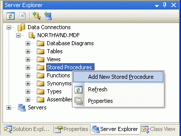

**Figure 6**: Add a New Stored Procedure for Paging Through the Products

This stored procedure should accept two integer input parameters - `@startRowIndex` and `@maximumRows` and use the `ROW_NUMBER()` function ordered by the `ProductName` field, returning only those rows greater than the specified `@startRowIndex` and less than or equal to `@startRowIndex` + `@maximumRow` s. Enter the following script into the new stored procedure and then click the Save icon to add the stored procedure to the database.

[!code-sql[Main](efficiently-paging-through-large-amounts-of-data-cs/samples/sample7.sql)]

After creating the stored procedure, take a moment to test it out. Right-click on the `GetProductsPaged` stored procedure name in the Server Explorer and choose the Execute option. Visual Studio will then prompt you for the input parameters, `@startRowIndex` and `@maximumRow` s (see Figure 7). Try different values and examine the results.

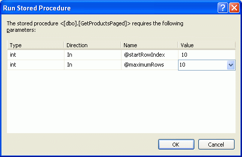

<strong>Figure 7</strong>: Enter a Value for the @startRowIndex and @maximumRows Parameters

After choosing these input parameters values, the Output window will show the results. Figure 8 shows the results when passing in 10 for both the `@startRowIndex` and `@maximumRows` parameters.

[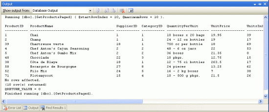](efficiently-paging-through-large-amounts-of-data-cs/_static/image8.png)

**Figure 8**: The Records That Would Appear in the Second Page of Data are Returned ([Click to view full-size image](efficiently-paging-through-large-amounts-of-data-cs/_static/image10.png))

With this stored procedure created, we re ready to create the `ProductsTableAdapter` method. Open the `Northwind.xsd` Typed DataSet, right-click in the `ProductsTableAdapter`, and choose the Add Query option. Instead of creating the query using an ad-hoc SQL statement, create it using an existing stored procedure.

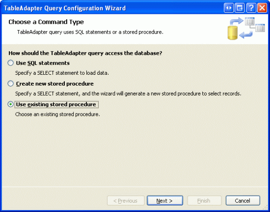

**Figure 9**: Create the DAL Method Using an Existing Stored Procedure

Next, we are prompted to select the stored procedure to invoke. Pick the `GetProductsPaged` stored procedure from the drop-down list.

**Figure 10**: Choose the GetProductsPaged Stored Procedure from the Drop-Down List

The next screen then asks you what kind of data is returned by the stored procedure: tabular data, a single value, or no value. Since the `GetProductsPaged` stored procedure can return multiple records, indicate that it returns tabular data.

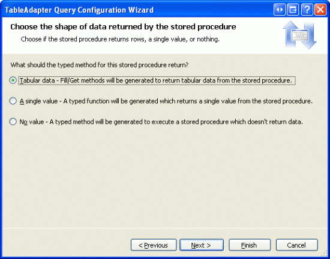

**Figure 11**: Indicate that the Stored Procedure Returns Tabular Data

Finally, indicate the names of the methods you want to have created. As with our previous tutorials, go ahead and create methods using both the Fill a DataTable and Return a DataTable. Name the first method `FillPaged` and the second `GetProductsPaged`.

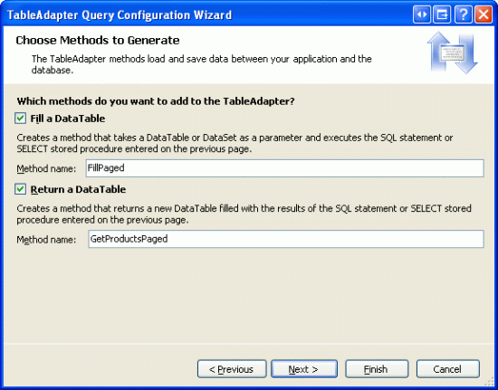

**Figure 12**: Name the Methods FillPaged and GetProductsPaged

In addition to created a DAL method to return a particular page of products, we also need to provide such functionality in the BLL. Like the DAL method, the BLL s GetProductsPaged method must accept two integer inputs for specifying the Start Row Index and Maximum Rows, and must return just those records that fall within the specified range. Create such a BLL method in the ProductsBLL class that merely calls down into the DAL s GetProductsPaged method, like so:

[!code-csharp[Main](efficiently-paging-through-large-amounts-of-data-cs/samples/sample8.cs)]

You can use any name for the BLL method s input parameters, but, as we will see shortly, choosing to use `startRowIndex` and `maximumRows` saves us from an extra bit of work when configuring an ObjectDataSource to use this method.

## Step 4: Configuring the ObjectDataSource to Use Custom Paging

With the BLL and DAL methods for accessing a particular subset of records complete, we re ready to create a GridView control that pages through its underlying records using custom paging. Start by opening the `EfficientPaging.aspx` page in the `PagingAndSorting` folder, add a GridView to the page, and configure it to use a new ObjectDataSource control. In our past tutorials, we often had the ObjectDataSource configured to use the `ProductsBLL` class s `GetProducts` method. This time, however, we want to use the `GetProductsPaged` method instead, since the `GetProducts` method returns *all* of the products in the database whereas `GetProductsPaged` returns just a particular subset of records.

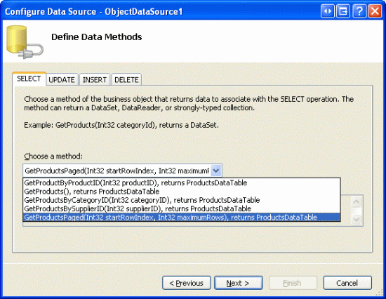

**Figure 13**: Configure the ObjectDataSource to Use the ProductsBLL Class s GetProductsPaged Method

Since we re creating a read-only GridView, take a moment to set the method drop-down list in the INSERT, UPDATE, and DELETE tabs to (None).

Next, the ObjectDataSource wizard prompts us for the sources of the `GetProductsPaged` method s `startRowIndex` and `maximumRows` input parameters values. These input parameters will actually be set by the GridView automatically, so simply leave the source set to None and click Finish.

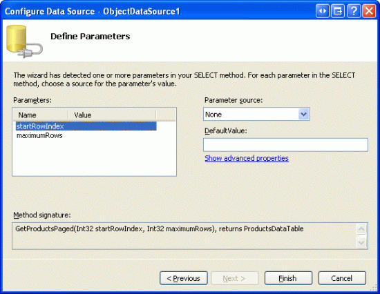

**Figure 14**: Leave the Input Parameter Sources as None

After completing the ObjectDataSource wizard, the GridView will contain a BoundField or CheckBoxField for each of the product data fields. Feel free to tailor the GridView s appearance as you see fit. I ve opted to display only the `ProductName`, `CategoryName`, `SupplierName`, `QuantityPerUnit`, and `UnitPrice` BoundFields. Also, configure the GridView to support paging by checking the Enable Paging checkbox in its smart tag. After these changes, the GridView and ObjectDataSource declarative markup should look similar to the following:

[!code-aspx[Main](efficiently-paging-through-large-amounts-of-data-cs/samples/sample9.aspx)]

If you visit the page through a browser, however, the GridView is no where to be found.

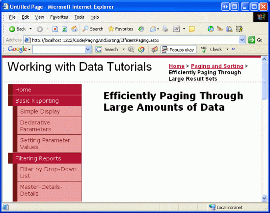

**Figure 15**: The GridView is Not Displayed

The GridView is missing because the ObjectDataSource is currently using 0 as the values for both of the `GetProductsPaged` `startRowIndex` and `maximumRows` input parameters. Hence, the resulting SQL query is returning no records and therefore the GridView is not displayed.

To remedy this, we need to configure the ObjectDataSource to use custom paging. This can be accomplished in the following steps:

1. **Set the ObjectDataSource s `EnablePaging` property to `true`** this indicates to the ObjectDataSource that it must pass to the `SelectMethod` two additional parameters: one to specify the Start Row Index ([`StartRowIndexParameterName`](https://msdn.microsoft.com/library/system.web.ui.webcontrols.objectdatasource.startrowindexparametername.aspx)), and one to specify the Maximum Rows ([`MaximumRowsParameterName`](https://msdn.microsoft.com/library/system.web.ui.webcontrols.objectdatasource.maximumrowsparametername.aspx)).
2. **Set the ObjectDataSource s `StartRowIndexParameterName` and `MaximumRowsParameterName` Properties Accordingly** the `StartRowIndexParameterName` and `MaximumRowsParameterName` properties indicate the names of the input parameters passed into the `SelectMethod` for custom paging purposes. By default, these parameter names are `startIndexRow` and `maximumRows`, which is why, when creating the `GetProductsPaged` method in the BLL, I used these values for the input parameters. If you chose to use different parameter names for the BLL s `GetProductsPaged` method such as `startIndex` and `maxRows`, for example you would need to set the ObjectDataSource s `StartRowIndexParameterName` and `MaximumRowsParameterName` properties accordingly (such as startIndex for `StartRowIndexParameterName` and maxRows for `MaximumRowsParameterName`).
3. **Set the ObjectDataSource s [`SelectCountMethod` Property](https://msdn.microsoft.com/library/system.web.ui.webcontrols.objectdatasource.selectcountmethod(VS.80).aspx) to the Name of the Method that Returns the Total Number of Records Being Paged Through (`TotalNumberOfProducts`)** recall that the `ProductsBLL` class s `TotalNumberOfProducts` method returns the total number of records being paged through using a DAL method that executes a `SELECT COUNT(*) FROM Products` query. This information is needed by the ObjectDataSource in order to correctly render the paging interface.
4. **Remove the `startRowIndex` and `maximumRows` `<asp:Parameter>` Elements from the ObjectDataSource s Declarative Markup** when configuring the ObjectDataSource through the wizard, Visual Studio automatically added two `<asp:Parameter>` elements for the `GetProductsPaged` method s input parameters. By setting `EnablePaging` to `true`, these parameters will be passed automatically; if they also appear in the declarative syntax, the ObjectDataSource will attempt to pass *four* parameters to the `GetProductsPaged` method and two parameters to the `TotalNumberOfProducts` method. If you forget to remove these `<asp:Parameter>` elements, when visiting the page through a browser you'll get an error message like: *ObjectDataSource 'ObjectDataSource1' could not find a non-generic method 'TotalNumberOfProducts' that has parameters: startRowIndex, maximumRows*.

After making these changes, the ObjectDataSource s declarative syntax should look like the following:

[!code-aspx[Main](efficiently-paging-through-large-amounts-of-data-cs/samples/sample10.aspx)]

Note that the `EnablePaging` and `SelectCountMethod` properties have been set and the `<asp:Parameter>` elements have been removed. Figure 16 shows a screen shot of the Properties window after these changes have been made.

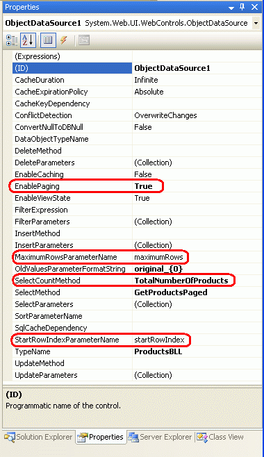

**Figure 16**: To Use Custom Paging, Configure the ObjectDataSource Control

After making these changes, visit this page through a browser. You should see 10 products listed, ordered alphabetically. Take a moment to step through the data one page at a time. While there is no visual difference from the end user s perspective between default paging and custom paging, custom paging more efficiently pages through large amounts of data as it only retrieves those records that need to be displayed for a given page.

[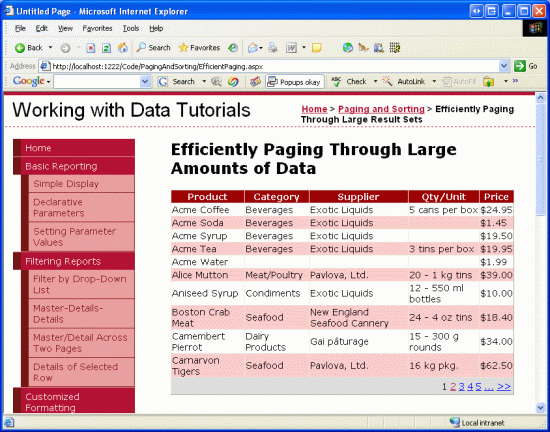](efficiently-paging-through-large-amounts-of-data-cs/_static/image19.png)

**Figure 17**: The Data, Ordered by the Product s Name, is Paged Using Custom Paging ([Click to view full-size image](efficiently-paging-through-large-amounts-of-data-cs/_static/image21.png))

> [!NOTE]
> With custom paging, the page count value returned by the ObjectDataSource�s `SelectCountMethod` is stored in the GridView�s view state. Other GridView variables the `PageIndex`, `EditIndex`, `SelectedIndex`, `DataKeys` collection, and so on are stored in *control state*, which is persisted regardless of the value of the GridView�s `EnableViewState` property. Since the `PageCount` value is persisted across postbacks using view state, when using a paging interface that includes a link to take you to the last page, it is imperative that the GridView�s view state be enabled. (If your paging interface does not include a direct link to the last page, then you may disable view state.)

Clicking the last page link causes a postback and instructs the GridView to update its `PageIndex` property. If the last page link is clicked, the GridView assigns its `PageIndex` property to a value one less than its `PageCount` property. With view state disabled, the `PageCount` value is lost across postbacks and the `PageIndex` is assigned the maximum integer value instead. Next, the GridView attempts to determine the starting row index by multiplying the `PageSize` and `PageCount` properties. This results in an `OverflowException` since the product exceeds the maximum allowed integer size.

## Implement Custom Paging and Sorting

Our current custom paging implementation requires that the order by which the data is paged through be specified statically when creating the `GetProductsPaged` stored procedure. However, you may have noted that the GridView s smart tag contains an Enable Sorting checkbox in addition to the Enable Paging option. Unfortunately, adding sorting support to the GridView with our current custom paging implementation will only sort the records on the currently viewed page of data. For example, if you configure the GridView to also support paging and then, when viewing the first page of data, sort by product name in descending order, it will reverse the order of the products on page 1. As Figure 18 shows, such shows Carnarvon Tigers as the first product when sorting in reverse alphabetical order, which ignores the 71 other products that come after Carnarvon Tigers, alphabetically; only those records on the first page are considered in the sorting.

[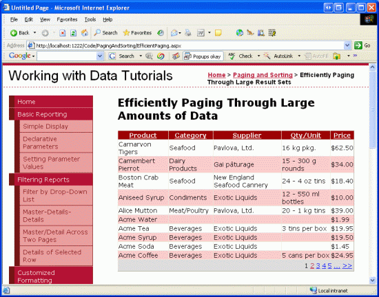](efficiently-paging-through-large-amounts-of-data-cs/_static/image22.png)

**Figure 18**: Only the Data Shown on the Current Page is Sorted ([Click to view full-size image](efficiently-paging-through-large-amounts-of-data-cs/_static/image24.png))

The sorting only applies to the current page of data because the sorting is occurring after the data has been retrieved from the BLL s `GetProductsPaged` method, and this method only returns those records for the specific page. To implement sorting correctly, we need to pass the sort expression to the `GetProductsPaged` method so that the data can be ranked appropriately before returning the specific page of data. We'll see how to accomplish this in our next tutorial.

## Implementing Custom Paging and Deleting

If you enabling deleting functionality in a GridView whose data is paged using custom paging techniques you will find that when deleting the last record from the last page, the GridView disappears rather than appropriately decrementing the GridView s `PageIndex`. To reproduce this bug, enable deleting for the tutorial just we just created. Go to the last page (page 9), where you should see a single product since we are paging through 81 products, 10 products at a time. Delete this product.

Upon deleting the last product, the GridView *should* automatically go to the eighth page, and such functionality is exhibited with default paging. With custom paging, however, after deleting that last product on the last page, the GridView simply disappears from the screen altogether. The precise reason *why* this happens is a bit beyond the scope of this tutorial; see [Deleting the Last Record on the Last Page from a GridView with Custom Paging](http://scottonwriting.net/sowblog/posts/7326.aspx) for the low-level details as to the source of this problem. In summary it s due to the following sequence of steps that are performed by the GridView when the Delete button is clicked:

1. Delete the record
2. Get the appropriate records to display for the specified `PageIndex` and `PageSize`
3. Check to ensure that the `PageIndex` does not exceed the number of pages of data in the data source; if it does, automatically decrement the GridView s `PageIndex` property
4. Bind the appropriate page of data to the GridView using the records obtained in Step 2

The problem stems from the fact that in Step 2 the `PageIndex` used when grabbing the records to display is still the `PageIndex` of the last page whose sole record was just deleted. Therefore, in Step 2, *no* records are returned since that last page of data no longer contains any records. Then, in Step 3, the GridView realizes that its `PageIndex` property is greater than the total number of pages in the data source (since we ve deleted the last record in the last page) and therefore decrements its `PageIndex` property. In Step 4 the GridView attempts to bind itself to the data retrieved in Step 2; however, in Step 2 no records were returned, therefore resulting in an empty GridView. With default paging, this problem doesn t surface because in Step 2 *all* records are retrieved from the data source.

To fix this we have two options. The first is to create an event handler for the GridView s `RowDeleted` event handler that determines how many records were displayed in the page that was just deleted. If there was only one record, then the record just deleted must have been the last one and we need to decrement the GridView s `PageIndex`. Of course, we only want to update the `PageIndex` if the delete operation was actually successful, which can be determined by ensuring that the `e.Exception` property is `null`.

This approach works because it updates the `PageIndex` after Step 1 but before Step 2. Therefore, in Step 2, the appropriate set of records is returned. To accomplish this, use code like the following:

[!code-csharp[Main](efficiently-paging-through-large-amounts-of-data-cs/samples/sample11.cs)]

An alternative workaround is to create an event handler for the ObjectDataSource s `RowDeleted` event and to set the `AffectedRows` property to a value of 1. After deleting the record in Step 1 (but before re-retrieving the data in Step 2), the GridView updates its `PageIndex` property if one or more rows were affected by the operation. However, the `AffectedRows` property is not set by the ObjectDataSource and therefore this step is omitted. One way to have this step executed is to manually set the `AffectedRows` property if the delete operation completes successfully. This can be accomplished using code like the following:

[!code-csharp[Main](efficiently-paging-through-large-amounts-of-data-cs/samples/sample12.cs)]

The code for both of these events handlers can be found in code-behind class of the `EfficientPaging.aspx` example.

## Comparing the Performance of Default and Custom Paging

Since custom paging only retrieves the needed records, whereas default paging returns *all* of the records for each page being viewed, it s clear that custom paging is more efficient than default paging. But just how much more efficient is custom paging? What sort of performance gains can be seen by moving from default paging to custom paging?

Unfortunately, there s no one size fits all answer here. The performance gain depends on a number of factors, the most prominent two being the number of records being paged through and the load placed on the database server and communication channels between the web server and database server. For small tables with just a few dozen records, the performance difference may be negligible. For large tables, with thousands to hundreds of thousands of rows, though, the performance difference is acute.

An article of mine, [Custom Paging in ASP.NET 2.0 with SQL Server 2005](http://aspnet.4guysfromrolla.com/articles/031506-1.aspx), contains some performance tests I ran to exhibit the differences in performance between these two paging techniques when paging through a database table with 50,000 records. In these tests I examined both the time to execute the query at the SQL Server level (using [SQL Profiler](https://msdn.microsoft.com/library/ms173757.aspx)) and at the ASP.NET page using [ASP.NET s tracing features](https://msdn.microsoft.com/library/y13fw6we.aspx). Keep in mind that these tests were run on my development box with a single active user, and therefore are unscientific and do not mimic typical website load patterns. Regardless, the results illustrate the relative differences in execution time for default and custom paging when working with sufficiently large amounts of data.

|  | **Avg. Duration (sec)** | **Reads** |
| --- | --- | --- |
| **Default Paging SQL Profiler** | 1.411 | 383 |
| **Custom Paging SQL Profiler** | 0.002 | 29 |
| **Default Paging ASP.NET Trace** | 2.379 | *N/A* |
| **Custom Paging ASP.NET Trace** | 0.029 | *N/A* |

As you can see, retrieving a particular page of data required 354 less reads on average and completed in a fraction of the time. At the ASP.NET page, custom the page was able to render in close to 1/100th of the time it took when using default paging. See [my article](http://aspnet.4guysfromrolla.com/articles/031506-1.aspx) for more information on these results along with code and a database you can download to reproduce these tests in your own environment.

## Summary

Default paging is a cinch to implement just check the Enable Paging checkbox in the data Web control s smart tag but such simplicity comes at the cost of performance. With default paging, when a user requests any page of data *all* records are returned, even though only a tiny fraction of them may be shown. To combat this performance overhead, the ObjectDataSource offers an alternative paging option custom paging.

While custom paging improves upon default paging s performance issues by retrieving only those records that need to be displayed, it s more involved to implement custom paging. First, a query must be written that correctly (and efficiently) accesses the specific subset of records requested. This can be accomplished in a number of ways; the one we examined in this tutorial is to use SQL Server 2005 s new `ROW_NUMBER()` function to rank results, and then to return just those results whose ranking falls within a specified range. Furthermore, we need to add a means to determine the total number of records being paged through. After creating these DAL and BLL methods, we also need to configure the ObjectDataSource so that it can determine how many total records are being paged through and can correctly pass the Start Row Index and Maximum Rows values to the BLL.

While implementing custom paging does require a number of steps and is not nearly as simple as default paging, custom paging is a necessity when paging through sufficiently large amounts of data. As the results examined showed, custom paging can shed seconds off of the ASP.NET page render time and can lighten the load on the database server by one ore more orders of magnitude.

Happy Programming!

## About the Author

[Scott Mitchell](http://www.4guysfromrolla.com/ScottMitchell.shtml), author of seven ASP/ASP.NET books and founder of [4GuysFromRolla.com](http://www.4guysfromrolla.com), has been working with Microsoft Web technologies since 1998. Scott works as an independent consultant, trainer, and writer. His latest book is [*Sams Teach Yourself ASP.NET 2.0 in 24 Hours*](https://www.amazon.com/exec/obidos/ASIN/0672327384/4guysfromrollaco). He can be reached at [mitchell@4GuysFromRolla.com.](mailto:mitchell@4GuysFromRolla.com) or via his blog, which can be found at [http://ScottOnWriting.NET](http://ScottOnWriting.NET).

> [!div class="step-by-step"]
> [Previous](paging-and-sorting-report-data-cs.md)
> [Next](sorting-custom-paged-data-cs.md)
