Adding Content to Source Control
====================
by [Jason Lee](https://github.com/jrjlee)

[Download PDF](https://msdnshared.blob.core.windows.net/media/MSDNBlogsFS/prod.evol.blogs.msdn.com/CommunityServer.Blogs.Components.WeblogFiles/00/00/00/63/56/8130.DeployingWebAppsInEnterpriseScenarios.pdf)

> This topic explains how to add content to source control in Team Foundation Server (TFS) 2010. It describes how to add solutions and projects to a team project in TFS, and it explains how to add external dependencies like frameworks or assemblies to source control.

This topic forms part of a series of tutorials based around the enterprise deployment requirements of a fictional company named Fabrikam, Inc. This tutorial series uses a sample solution&#x2014;the [Contact Manager solution](../web-deployment-in-the-enterprise/the-contact-manager-solution.md)&#x2014;to represent a web application with a realistic level of complexity, including an ASP.NET MVC 3 application, a Windows Communication Foundation (WCF) service, and a database project.

## Task Overview

In most cases, every member of the developer team should be able to add content to source control. To add a solution to source control in TFS, you'll need to complete these high-level steps:

- Connect to a team project.
- Map the team project folder structure on the server to a folder structure on your local computer.
- Add the solution and its contents to source control.
- Add any external dependencies to source control.

This topic will show you how to perform these procedures.

The tasks and walkthroughs in this topic assume that you've already created a new TFS team project to manage your content. For more information on creating a new team project, see [Creating a Team Project in TFS](creating-a-team-project-in-tfs.md).

### Who Performs These Procedures?

In most cases, every member of the developer team should be able to add and modify content within specific team projects.

## Connect to a Team Project and Create a Folder Mapping

Before you add any content to source control, you need to connect to a team project and create a mapping between the folder structure on the server and the file system on your local machine.

**To connect to a team project and map a local path**

1. On your developer workstation, open Visual Studio 2010.
2. In Visual Studio, on the **Team** menu, click **Connect to Team Foundation Server**.

    > [!NOTE]
    > If you have already configured a connection to a TFS server, you can omit steps 3-6.
3. In the **Connection to Team Project** dialog box, click **Servers**.
4. In the **Add/Remove Team Foundation Server** dialog box, click **Add**.
5. In the **Add Team Foundation Server** dialog box, provide the details of your TFS instance, and then click **OK**.

    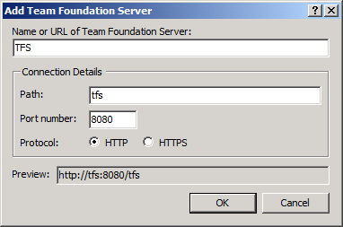
6. In the **Add/Remove Team Foundation Server** dialog box, click **Close**.
7. In the **Connect to Team Project** dialog box, select the TFS instance you want to connect to, select the team project collection, select the team project you want to add to, and then click **Connect**.

    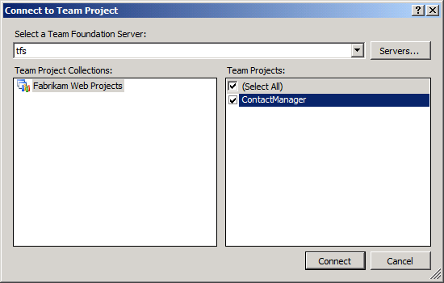
8. In the **Team Explorer** window, expand your team project, and then double-click **Source Control**.

    
9. On the **Source Control Explorer** tab, click **Not mapped**.

    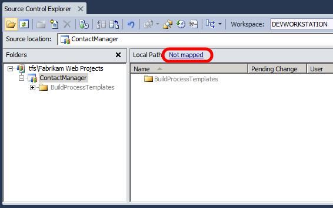
10. In the **Map** dialog box, in the **Local folder** box, browse to (or create) a local folder to act as the root folder for the team project, and then click **Map**.

    
11. When you're prompted to download source files, click **Yes**.

    

At this point, you have mapped the server-side folder for the team project to a local folder on your developer workstation. You've also downloaded any existing content from the team project to your local folder structure. You can now start to add your own content to source control.

## Add Projects and Solutions to Source Control

To add projects and solutions to source control, you first need to move them to the mapped folder for the team project on your local machine. You can then check in the content to synchronize your additions with the server.

**To add projects to source control**

1. On your developer workstation, move your projects and solutions to an appropriate location within the mapped folder structure for the team project.

    > [!NOTE]
    > Many organizations will have a preferred approach to how projects and solutions should be organized in source control. For guidance on how to structure folders, see [How To: Structure Your Source Control Folders in Team Foundation Server](https://msdn.microsoft.com/library/bb668992.aspx).
2. Open the solution in Visual Studio 2010.
3. In the **Solution Explorer** window, right-click the solution, and then click **Add Solution to Source Control**.

    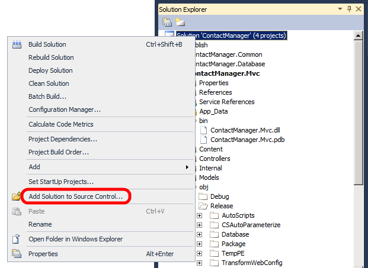

    > [!NOTE]
    > In some cases, depending on how your organization likes to structure content in TFS, you may need to add projects to source control individually to provide more fine-grained control over how your source code is organized.
4. Verify that the **Source Control Explorer** tab displays the content you've added within the server folder structure for the team project.

    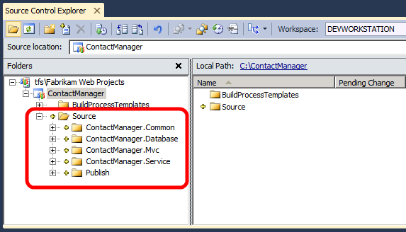

    > [!NOTE]
    > The **Source Control Explorer** tab displays your content with no further prompting because you added your solution to a mapped folder on the local file system. If your solution was in an unmapped location, you'd be prompted to specify folder locations in both TFS and your local file system.
5. On the **Source Control Explorer** tab, in the **Folders** pane, right-click the team project (for example, **ContactManager**), and then click **Check In Pending Changes**.
6. In the **Check In – Source Files** dialog box, type a comment, and then click **Check In**.

    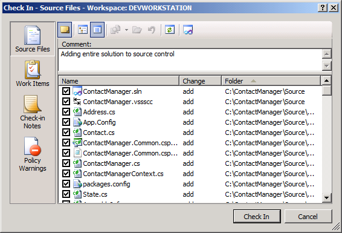

At this point you have added your solution to source control in TFS.

## Add External Dependencies to Source Control

When you add a project or solution to source control, any files and folders within your project or solution will also be added. However, in a lot of cases, projects and solutions also rely on external dependencies, like local assemblies, to function properly. You need to add any such resources to source control to let both Team Build and other members of the developer team build your code successfully.

For example, the folder structure for the Contact Manager sample solution includes a folder named packages. This contains the assembly and various supporting resources for the ADO.NET Entity Framework 4.1. The packages folder is not part of the Contact Manager solution, but the solution will not build successfully without it. To enable Team Build to build the solution, you need to add the packages folder to source control.

> [!NOTE]
> The inclusion of a packages folder is typical of what happens when you add the Entity Framework, or similar resources, to your solution using the NuGet extension for Visual Studio 2010.

**To add non-project content to source control**

1. Ensure that the items you want to add (for example, the packages folder) are in an appropriate location within a mapped folder on your local file system.
2. In Visual Studio 2010, In the **Team Explorer** window, expand your team project, and then double-click **Source Control**.

    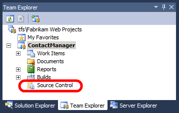
3. On the **Source Control Explorer** tab, in the **Folders** pane, select the folder that contains the item or items you want to add.
4. Click the **Add Items to Folder** button.

    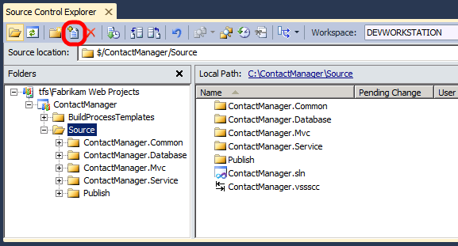
5. In the **Add to Source Control** dialog box, select the folder or items you want to add, and then click **Next**.

    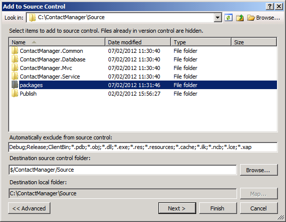
6. On the **Excluded items** tab, select any required items that have been automatically excluded (for example, assemblies), and then click **Include item(s)**.

    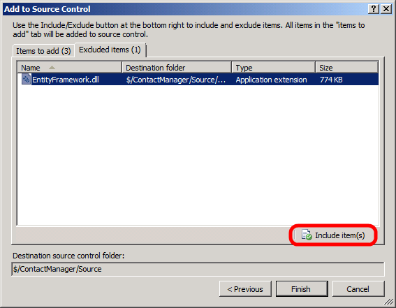
7. On the **Items to add** tab, verify that all the files you want to include are listed, and then click **Finish**.

    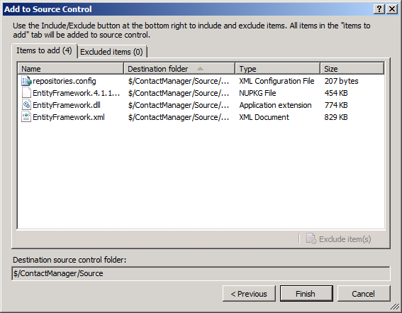
8. In the **Source Control Explorer** window, click the **Check In** button.

    
9. In the **Check In – Source Files** dialog box, type a comment, and then click **Check In**.

At this point, you have added the external dependencies for your solution to source control.

## Conclusion

This topic described how to connect to a team project, map a folder structure, and add content to source control. For more information on how to work with items under source control, see [Using Version Control](https://msdn.microsoft.com/library/ms181368.aspx).

The next topic, [Configuring a TFS Build Server for Web Deployment](configuring-a-tfs-build-server-for-web-deployment.md), describes how to prepare a TFS Team Build server to build and deploy your solution.

## Further Reading

For more comprehensive information on working with source control in TFS, see [Using Version Control](https://msdn.microsoft.com/library/ms181368.aspx).

> [!div class="step-by-step"]
> [Previous](creating-a-team-project-in-tfs.md)
> [Next](configuring-a-tfs-build-server-for-web-deployment.md)
