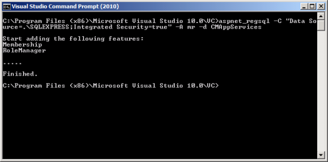
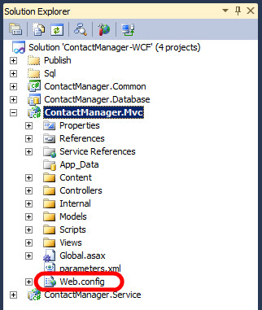
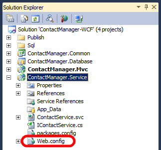
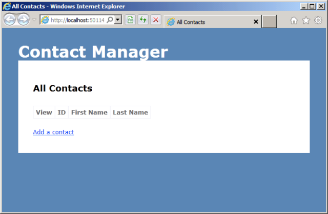
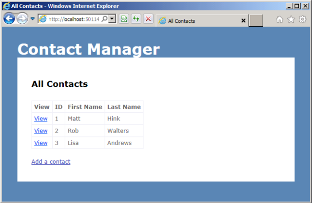
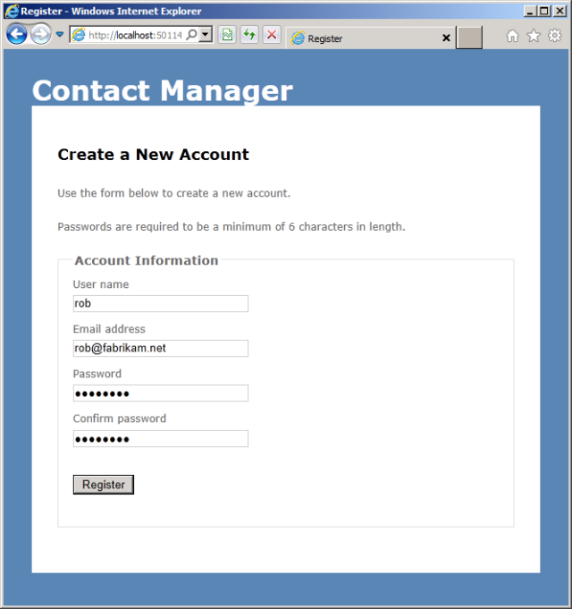
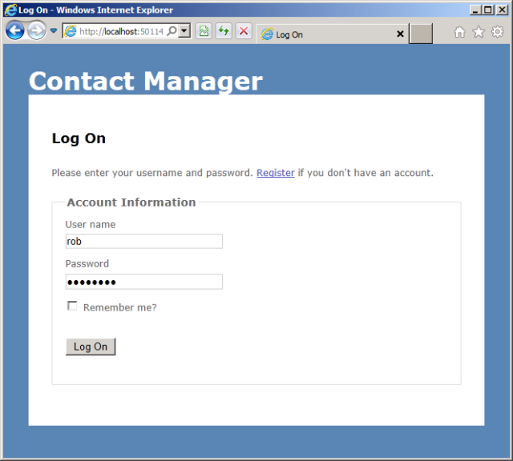

Setting Up the Contact Manager Solution
====================
by [Jason Lee](https://github.com/jrjlee)

[Download PDF](https://msdnshared.blob.core.windows.net/media/MSDNBlogsFS/prod.evol.blogs.msdn.com/CommunityServer.Blogs.Components.WeblogFiles/00/00/00/63/56/8130.DeployingWebAppsInEnterpriseScenarios.pdf)

> This topic describes how to download and configure the Contact Manager solution to run locally on a developer workstation.

## System Requirements

To run the Contact Manager solution locally and to perform the other tasks described in this tutorial, you'll need to install this software on your developer workstation:

- Visual Studio 2010 Service Pack 1, Premium or Ultimate Edition
- Internet Information Services (IIS) 7.5 Express
- SQL Server Express 2008 R2
- IIS Web Deployment Tool (Web Deploy) 2.1 or later
- ASP.NET 4.0
- ASP.NET MVC 3
- .NET Framework 4
- .NET Framework 3.5 SP1

With the exception of Visual Studio 2010, you can download and install the latest versions of all of these products and components through the [Web Platform Installer](https://go.microsoft.com/?linkid=9805118).

## Download and Extract the Solution

You can download the Contact Manager sample application from the MSDN Code Gallery [here](https://code.msdn.microsoft.com/Deploying-Web-Applications-9d9093c0).

## Configure and Run the Solution

To configure and run the Contact Manager solution on your local machine, you'll need to perform these high-level steps:

1. If you don't have one already, create a local ASP.NET application services database with the membership and role management features enabled.
2. Edit connection strings in the *web.config* files to point to your local SQL Server Express instance.
3. Run the solution from Visual Studio 2010.

The remainder of this section provides more guidance on how to complete each of these tasks.

**To create the application services database**

1. Open a Visual Studio 2010 command prompt. To do this, on the **Start** menu, point to **All Programs**, click **Microsoft Visual Studio 2010**, click **Visual Studio Tools**, and then click **Visual Studio Command Prompt (2010)**.
2. At the command prompt, type this command, and then press Enter:

    [!code-console[Main](setting-up-the-contact-manager-solution/samples/sample1.cmd)]

    1. Use the **–C** switch to specify the connection string for your database server.
    2. Use the **–A** switch to specify the application services features you want to add to the database. In this case, **m** indicates that you want to add support for the membership provider and **r** indicates that you want to add support for the role manager.
    3. Use the **–d** switch to specify a name for your application services database. If you omit this switch, the utility will create a database with the default name of **aspnetdb**.
3. When the database has been created successfully, the command prompt will show a confirmation.

    

> [!NOTE]
> For more information on the aspnet\_regsql utility, see [ASP.NET SQL Server Registration Tool (Aspnet\_regsql.exe)](https://msdn.microsoft.com/library/ms229862(v=vs.100).aspx).

The next step is to make sure that the connection strings in the Contact Manager solution point to your local instance of SQL Server Express.

**To update the connection strings**

1. Open the Contact Manager solution in Visual Studio 2010.
2. In the **Solution Explorer** window, expand the **ContactManager.Mvc** project, and then double-click the **Web.config** node.

    > [!NOTE]
    > The ContactManager.Mvc project includes two *web.config* files. You need to edit the project-level file.

    
3. In the **connectionStrings** element, verify that the connection string named **ApplicationServices** points to your local ASP.NET application services database.

    [!code-xml[Main](setting-up-the-contact-manager-solution/samples/sample2.xml)]
4. In the **Solution Explorer** window, expand the **ContactManager.Service** project, and then double-click the **Web.config** node.

    
5. In the **connectionStrings** element, in the connection string named **ContactManagerContext**, verify that the **Data Source** property is set to your local instance of SQL Server Express. You don't need to change anything else in the connection string.

    [!code-xml[Main](setting-up-the-contact-manager-solution/samples/sample3.xml)]
6. Save all open files.

You should now be ready to run the Contact Manager solution on your local machine.

> [!NOTE]
> If you follow these steps without first creating an application services database, ASP.NET will create the database the first time you attempt to create a user. However, manually creating the database gives you a lot more control over the application services feature set you want to support.

**To run the Contact Manager solution**

1. In Visual Studio 2010, press F5.
2. Internet Explorer starts up and requests the URL of the Contact Manager ASP.NET MVC 3 application. By default, the application displays the **All Contacts** page.

    
3. Add a few contacts, and then verify that the application works as expected.

    
4. Browse to `http://localhost:50114/Account/Register` (adjust the URL if you're hosting the application on a different port). Add a user name, email address, and password, and verify that you're able to register an account successfully.

    
5. Browse to `http://localhost:50114/Account/LogOn` (adjust the URL if you're hosting the application on a different port). Verify that you're able to log on using the account you just created.

    
6. Close Internet Explorer to stop debugging.

## Conclusion

At this point, the Contact Manager solution should be fully configured to run on your local machine. You can use the solution as a reference when you work through the other topics in this tutorial.

The next topic, [Understanding the Project File](understanding-the-project-file.md), explains how you can use the custom Microsoft Build Engine (MSBuild) project files within the Contact Manager solution to control the deployment process.

> [!div class="step-by-step"]
> [Previous](the-contact-manager-solution.md)
> [Next](understanding-the-project-file.md)
