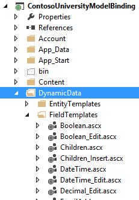
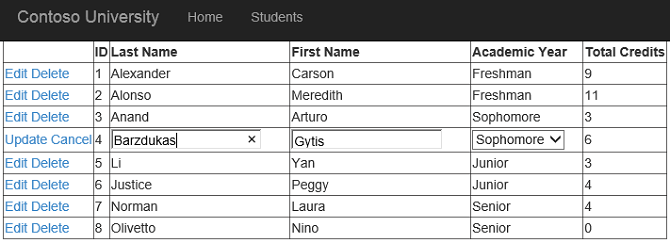
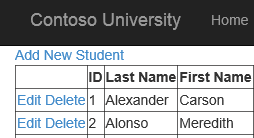
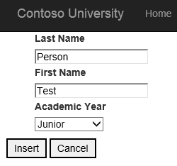
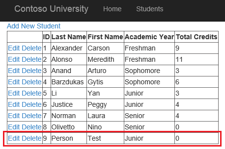

Updating, deleting, and creating data with model binding and web forms
====================
by [Tom FitzMacken](https://github.com/tfitzmac)

> This tutorial series demonstrates basic aspects of using model binding with an ASP.NET Web Forms project. Model binding makes data interaction more straight-forward than dealing with data source objects (such as ObjectDataSource or SqlDataSource). This series starts with introductory material and moves to more advanced concepts in later tutorials.
> 
> This tutorial shows how to create, update, and delete data with model binding. You will set the following properties:
> 
> - DeleteMethod
> - InsertMethod
> - UpdateMethod
> 
> These properties receive the name of the method that handles the corresponding operation. Within that method, you provide the logic for interacting with the data.
> 
> This tutorial builds on the project created in the first [part](retrieving-data.md) of the series.
> 
> You can [download](https://go.microsoft.com/fwlink/?LinkId=286116) the complete project in C# or VB. The downloadable code works with either Visual Studio 2012 or Visual Studio 2013. It uses the Visual Studio 2012 template, which is slightly different than the Visual Studio 2013 template shown in this tutorial.

## What you'll build

In this tutorial, you'll:

1. Add dynamic data templates
2. Enable updating and deleting data through model binding methods
3. Apply data validation rules - Enable creating a new record in the database

## Add dynamic data templates

To provide the best user experience and minimize code repetition, you will use dynamic data templates. You can easily integrate pre-built dynamic data templates into your existing site by installing a NuGet package.

From the **Manage NuGet Packages**, install the **DynamicDataTemplatesCS**.

Notice that your project now includes a folder named **DynamicData**. In that folder, you will find the templates that are automatically applied to dynamic controls in your web forms.

## Enable updating and deleting

Enabling users to update and delete records in the database is very similar to the process for retrieving data. In the **UpdateMethod** and **DeleteMethod** properties, you specify the names of the methods that perform those operations. With a GridView control, you can also specify the automatic generation of edit and delete buttons. The following highlighted code shows the additions to the GridView code.

[!code-aspx[Main](updating-deleting-and-creating-data/samples/sample1.aspx?highlight=4-5)]

In the code-behind file, add a using statement for **System.Data.Entity.Infrastructure**.

[!code-csharp[Main](updating-deleting-and-creating-data/samples/sample2.cs)]

Then, add the following update and delete methods.

[!code-csharp[Main](updating-deleting-and-creating-data/samples/sample3.cs)]

The **TryUpdateModel** method applies the matching data-bound values from the web form to the data item. The data item is retrieved based on the value of the id parameter.

## Enforce validation requirements

The validation attributes that you applied to the FirstName, LastName, and Year properties in the Student class are automatically enforced when updating the data. The DynamicField controls add client and server validators based on the validation attributes. The FirstName and LastName properties are both required. FirstName cannot exceed 20 characters in length, and LastName cannot exceed 40 characters. Year must be a valid value for the AcademicYear enumeration.

If the user violates one of the validation requirements, the update does not proceed. To see the error message, add a ValidationSummary control above the GridView. To display the validation errors from model binding, set the **ShowModelStateErrors** property set to **true**. 

[!code-aspx[Main](updating-deleting-and-creating-data/samples/sample4.aspx)]

Run the web application, and update and delete any of the records.

Notice that when in the edit mode the value for the Year property is automatically rendered as a drop down list. The Year property is an enumeration value, and the dynamic data template for an enumeration value specifies a drop down list for editing. You can find that template by opening the **Enumeration\_Edit.ascx** file in the **DynamicData**/**FieldTemplates** folder.

If you provide valid values, the update completes successfully. If you violate one of the validation requirements, the update does not proceed and an error message is displayed above the grid.

## Add new records

The GridView control does not include the **InsertMethod** property and therefore cannot be used for adding a new record with model binding. You can find the InsertMethod property in the **FormView**, **DetailsView**, or **ListView** controls. In this tutorial, you will use a FormView control to add a new record.

First, add a link to the new page you will create for adding a new record. Above the ValidationSummary, add:

[!code-aspx[Main](updating-deleting-and-creating-data/samples/sample5.aspx)]

The new link will appear at the top of the content for the Students page.

Then, add a new web form using a master page, and name it **AddStudent**. Select Site.Master as the master page.

You will render the fields for adding a new student by using a **DynamicEntity** control. The DynamicEntity control renders that editable properties in the class specified in the ItemType property. The StudentID property was marked with the **[ScaffoldColumn(false)]** attribute so it is not rendered. In the MainContent placeholder of the AddStudent page, add the following code.

[!code-aspx[Main](updating-deleting-and-creating-data/samples/sample6.aspx)]

In the code-behind file (AddStudent.aspx.cs), add a **using** statement for the **ContosoUniversityModelBinding.Models** namespace.

[!code-csharp[Main](updating-deleting-and-creating-data/samples/sample7.cs)]

Then, add the following methods to specify how to insert a new record and an event handler for the cancel button.

[!code-csharp[Main](updating-deleting-and-creating-data/samples/sample8.cs)]

Save all of the changes.

Run the web application and create a new student.

Click **Insert** and notice the new student has been created.

## Conclusion

In this tutorial, you enabled updating, deleting, and creating data. You ensured validation rules are applied when interacting with the data.

In the next [tutorial](sorting-paging-and-filtering-data.md) in this series, you will enable sorting, paging, and filtering data.

> [!div class="step-by-step"]
> [Previous](retrieving-data.md)
> [Next](sorting-paging-and-filtering-data.md)
