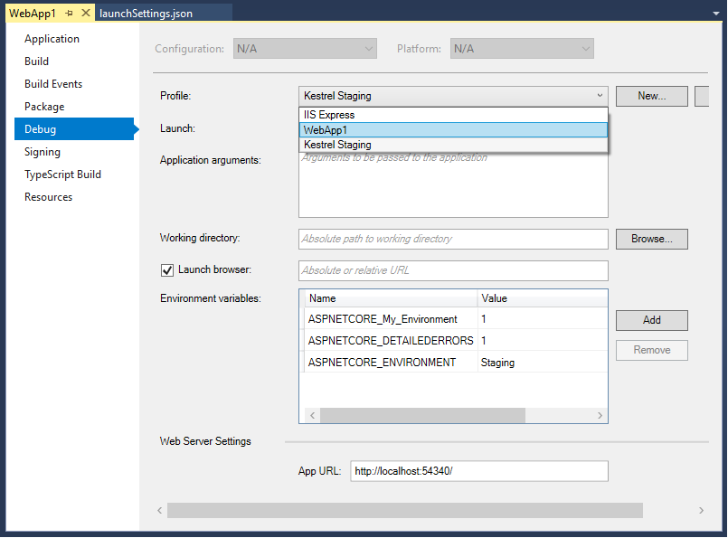
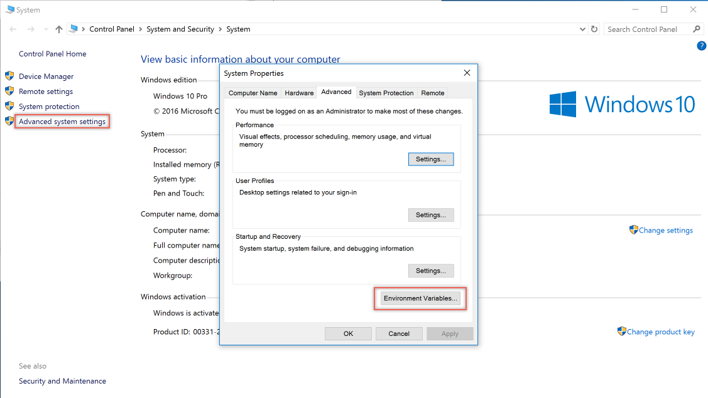

# Use multiple environments in ASP.NET Core

By [Rick Anderson](https://twitter.com/RickAndMSFT)

ASP.NET Core provides support for setting application behavior at runtime with environment variables.

[View or download sample code](https://github.com/aspnet/Docs/tree/master/aspnetcore/fundamentals/environments/sample) ([how to download](xref:tutorials/index#how-to-download-a-sample))

## Environments

ASP.NET Core reads the environment variable `ASPNETCORE_ENVIRONMENT` at application startup and stores that value in [IHostingEnvironment.EnvironmentName](/dotnet/api/microsoft.aspnetcore.hosting.ihostingenvironment.environmentname?view=aspnetcore-2.0#Microsoft_AspNetCore_Hosting_IHostingEnvironment_EnvironmentName). `ASPNETCORE_ENVIRONMENT` can be set to any value, but [three values](/dotnet/api/microsoft.aspnetcore.hosting.environmentname?view=aspnetcore-2.0) are supported by the framework: [Development](/dotnet/api/microsoft.aspnetcore.hosting.environmentname.development?view=aspnetcore-2.0), [Staging](/dotnet/api/microsoft.aspnetcore.hosting.environmentname.staging?view=aspnetcore-2.0), and [Production](/dotnet/api/microsoft.aspnetcore.hosting.environmentname.production?view=aspnetcore-2.0). If `ASPNETCORE_ENVIRONMENT` isn't set, it will default to `Production`.

[!code-csharp[](environments/sample/WebApp1/Startup.cs?name=snippet)]

The preceding code:

* Calls [UseDeveloperExceptionPage](/dotnet/api/microsoft.aspnetcore.builder.developerexceptionpageextensions.usedeveloperexceptionpage?view=aspnetcore-2.0#Microsoft_AspNetCore_Builder_DeveloperExceptionPageExtensions_UseDeveloperExceptionPage_Microsoft_AspNetCore_Builder_IApplicationBuilder_) and [UseBrowserLink](/dotnet/api/microsoft.aspnetcore.builder.browserlinkextensions.usebrowserlink?view=aspnetcore-2.0#Microsoft_AspNetCore_Builder_BrowserLinkExtensions_UseBrowserLink_Microsoft_AspNetCore_Builder_IApplicationBuilder_) when `ASPNETCORE_ENVIRONMENT` is set to `Development`.
* Calls [UseExceptionHandler](/dotnet/api/microsoft.aspnetcore.builder.exceptionhandlerextensions.useexceptionhandler?view=aspnetcore-2.0#Microsoft_AspNetCore_Builder_ExceptionHandlerExtensions_UseExceptionHandler_Microsoft_AspNetCore_Builder_IApplicationBuilder_) when the value of `ASPNETCORE_ENVIRONMENT` is set one of the following:

    * `Staging`
    * `Production`
    * `Staging_2`

The [Environment Tag Helper ](xref:mvc/views/tag-helpers/builtin-th/environment-tag-helper) uses the value of `IHostingEnvironment.EnvironmentName` to include or exclude markup in the element:

[!code-html[](environments/sample/WebApp1/Pages/About.cshtml)]

Note: On Windows and macOS, environment variables and values are not case sensitive. Linux environment variables and values are **case sensitive** by default.

### Development

The development environment can enable features that shouldn't be exposed in production. For example, the ASP.NET Core templates enable the [developer exception page](xref:fundamentals/error-handling#the-developer-exception-page) in the development environment.

The environment for local machine development can be set in the *Properties\launchSettings.json* file of the project. Environment values set in *launchSettings.json* override values set in the system environment.

The following JSON shows three profiles from a *launchSettings.json* file:

[!code-json[](environments/sample/WebApp1/Properties/launchSettings.json?highlight=10,11,18,26)]

::: moniker range=">= aspnetcore-2.1"
> [!NOTE]
> The `applicationUrl` property in *launchSettings.json* can specify a list of server URLs. Use a semicolon between the URLs in the list:
>
> ```json
> "WebApplication1": {
>    "commandName": "Project",
>    "launchBrowser": true,
>    "applicationUrl": "https://localhost:5001;http://localhost:5000",
>    "environmentVariables": {
>      "ASPNETCORE_ENVIRONMENT": "Development"
>    }
> }
> ```
::: moniker-end

When the application is launched with [dotnet run](/dotnet/core/tools/dotnet-run), the first profile with `"commandName": "Project"` will be used. The value of `commandName` specifies the web server to launch. `commandName` can be one of :

* IIS Express
* IIS
* Project (which launches Kestrel)

When an app is launched with [dotnet run](/dotnet/core/tools/dotnet-run):

* *launchSettings.json* is read if available. `environmentVariables` settings in *launchSettings.json* override environment variables.
* The hosting environment is displayed.


The following output shows an app started with [dotnet run](/dotnet/core/tools/dotnet-run):
```bash
PS C:\Webs\WebApp1> dotnet run
Using launch settings from C:\Webs\WebApp1\Properties\launchSettings.json...
Hosting environment: Staging
Content root path: C:\Webs\WebApp1
Now listening on: http://localhost:54340
Application started. Press Ctrl+C to shut down.
```

The Visual Studio **Debug** tab provides a GUI to edit the *launchSettings.json* file:



Changes made to project profiles may not take effect until the web server is restarted. Kestrel must be restarted before it will detect changes made to its environment.

>[!WARNING]
> *launchSettings.json* shouldn't store secrets. The [Secret Manager tool](xref:security/app-secrets) can be used to store secrets for local development.

### Production

The production environment should be configured to maximize security, performance, and application robustness. Some common settings that differ from development include:

* Caching.
* Client-side resources are bundled, minified, and potentially served from a CDN.
* Diagnostic error pages disabled.
* Friendly error pages enabled.
* Production logging and monitoring enabled. For example, [Application Insights](/azure/application-insights/app-insights-asp-net-core).

## Setting the environment

It's often useful to set a specific environment for testing. If the environment isn't set, it will default to `Production` which disables most debugging features.

The method for setting the environment depends on the operating system.

### Azure

For Azure app service:

* Select the **Application settings** blade.
* Add the key and value in **App settings**.


### Windows
To set the `ASPNETCORE_ENVIRONMENT` for the current session, if the app is started using [dotnet run](/dotnet/core/tools/dotnet-run), the following commands are used

**Command line**
```
set ASPNETCORE_ENVIRONMENT=Development
```
**PowerShell**
```
$Env:ASPNETCORE_ENVIRONMENT = "Development"
```

These commands take effect only for the current window. When the window is closed, the ASPNETCORE_ENVIRONMENT setting reverts to the default setting or machine value. In order to set the value globally on Windows open the **Control Panel** > **System** > **Advanced system settings** and add or edit the `ASPNETCORE_ENVIRONMENT` value.




**web.config**

See the *Setting environment variables* section of the [ASP.NET Core Module configuration reference](xref:host-and-deploy/aspnet-core-module#setting-environment-variables) topic.

**Per IIS Application Pool**

To set environment variables for individual apps running in isolated Application Pools (supported on IIS 10.0+), see the *AppCmd.exe command* section of the [Environment Variables \<environmentVariables>](/iis/configuration/system.applicationHost/applicationPools/add/environmentVariables/#appcmdexe) topic.

### macOS
Setting the current environment for macOS can be done in-line when running the application;

```bash
ASPNETCORE_ENVIRONMENT=Development dotnet run
```
or using `export` to set it prior to running the app.

```bash
export ASPNETCORE_ENVIRONMENT=Development
```
Machine level environment variables are set in the *.bashrc* or *.bash_profile* file. Edit the file using any text editor and add the following statment.

```bash
export ASPNETCORE_ENVIRONMENT=Development
```

### Linux
For Linux distros, use the `export` command at the command line for session based variable settings and *bash_profile* file for machine level environment settings.

### Configuration by environment

See [Configuration by environment](xref:fundamentals/configuration/index#configuration-by-environment) for more information.

<a name="startup-conventions"></a>
## Environment based Startup class and methods

When an ASP.NET Core app starts, the [Startup class](xref:fundamentals/startup) bootstraps the app. If a class `Startup{EnvironmentName}` exists, that class will be called for that `EnvironmentName`:

[!code-csharp[](environments/sample/WebApp1/StartupDev.cs?name=snippet&highlight=1)]

Note: Calling [WebHostBuilder.UseStartup<TStartup>](/dotnet/api/microsoft.aspnetcore.hosting.webhostbuilderextensions.usestartup?view=aspnetcore-2.0#Microsoft_AspNetCore_Hosting_WebHostBuilderExtensions_UseStartup__1_Microsoft_AspNetCore_Hosting_IWebHostBuilder_) overrides configuration sections.

[Configure](/dotnet/api/microsoft.aspnetcore.hosting.startupbase.configure?view=aspnetcore-2.0#Microsoft_AspNetCore_Hosting_StartupBase_Configure_Microsoft_AspNetCore_Builder_IApplicationBuilder_) and [ConfigureServices](/dotnet/api/microsoft.aspnetcore.hosting.startupbase.configureservices?view=aspnetcore-2.0) support environment specific versions of the form `Configure{EnvironmentName}` and `Configure{EnvironmentName}Services`:

[!code-csharp[](environments/sample/WebApp1/Startup.cs?name=snippet_all&highlight=15,37)]

## Additional resources

* [Application startup](xref:fundamentals/startup)
* [Configuration](xref:fundamentals/configuration/index)
* [IHostingEnvironment.EnvironmentName](/dotnet/api/microsoft.aspnetcore.hosting.ihostingenvironment.environmentname?view=aspnetcore-2.0#Microsoft_AspNetCore_Hosting_IHostingEnvironment_EnvironmentName)
