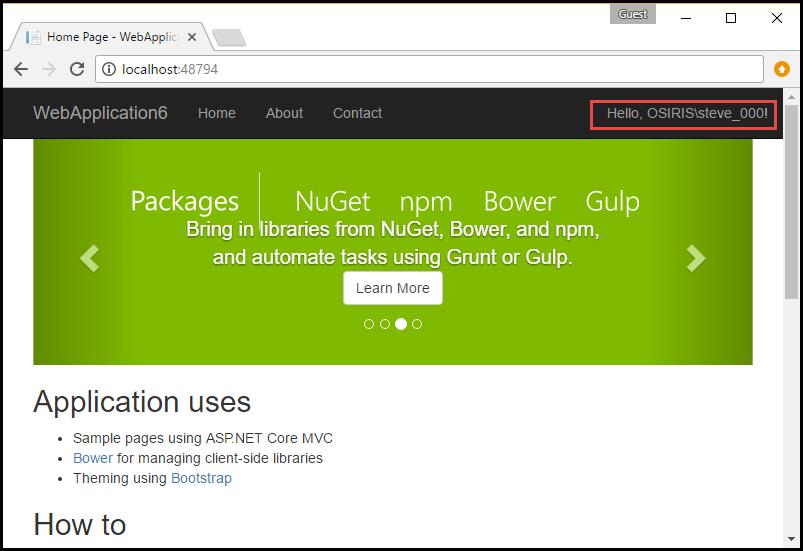
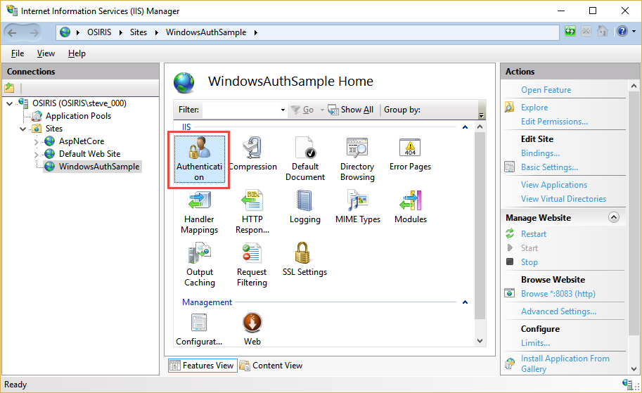
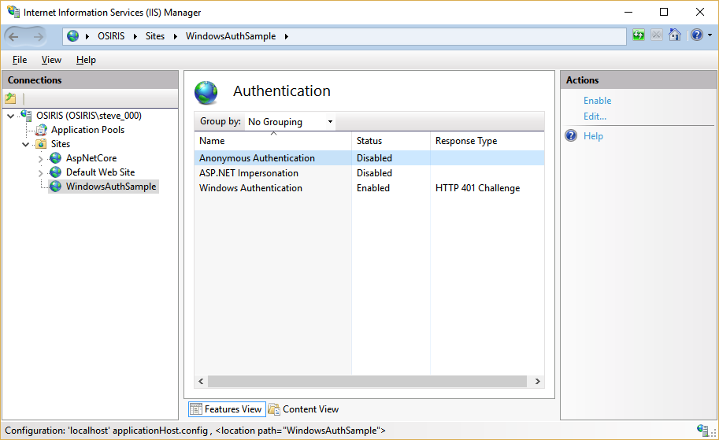
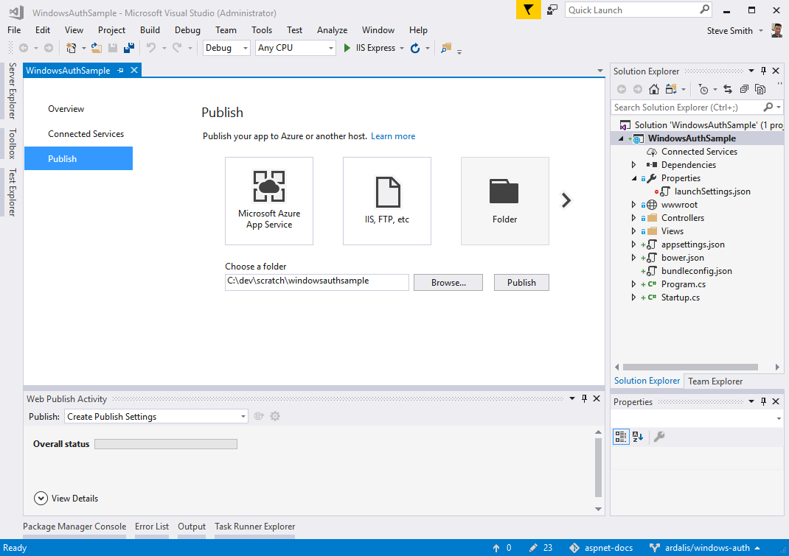

# Configure Windows authentication in ASP.NET Core

By [Steve Smith](https://ardalis.com) and [Scott Addie](https://twitter.com/Scott_Addie)

Windows authentication can be configured for ASP.NET Core apps hosted with IIS, [HTTP.sys](xref:fundamentals/servers/httpsys), or [WebListener](xref:fundamentals/servers/weblistener).

## What is Windows authentication?

Windows authentication relies on the operating system to authenticate users of ASP.NET Core apps. You can use Windows authentication when your server runs on a corporate network using Active Directory domain identities or other Windows accounts to identify users. Windows authentication is best suited to intranet environments in which users, client applications, and web servers belong to the same Windows domain.

[Learn more about Windows authentication and installing it for IIS](/iis/configuration/system.webServer/security/authentication/windowsAuthentication/).

## Enable Windows authentication in an ASP.NET Core app

The Visual Studio Web Application template can be configured to support Windows authentication.

### Use the Windows authentication app template

In Visual Studio:
1. Create a new ASP.NET Core Web Application. 
1. Select Web Application from the list of templates.
1. Select the **Change Authentication** button and select **Windows Authentication**. 

Run the app. The username appears in the top right of the app.



For development work using IIS Express, the template provides all the configuration necessary to use Windows authentication. The following section shows how to manually configure an ASP.NET Core app for Windows authentication.

### Visual Studio settings for Windows and anonymous authentication

The Visual Studio project **Properties** page's **Debug** tab provides check boxes for Windows authentication and anonymous authentication.


Alternatively, these two properties can be configured in the *launchSettings.json* file:

[!code-json[](windowsauth/sample/launchSettings.json?highlight=3-4)]

## Enable Windows authentication with IIS

IIS uses the [ASP.NET Core Module](xref:fundamentals/servers/aspnet-core-module) to host ASP.NET Core apps. The module flows Windows authentication to IIS by default. Windows authentication is configured in IIS, not the app. The following sections show how to use IIS Manager to configure an ASP.NET Core app to use Windows authentication.

### Create a new IIS site

Specify a name and folder and allow it to create a new application pool.

### Customize authentication

Open the Authentication menu for the site.



Disable Anonymous Authentication and enable Windows Authentication.



### Publish your project to the IIS site folder

Using Visual Studio or the .NET Core CLI, publish the app to the destination folder.



Learn more about [publishing to IIS](xref:host-and-deploy/iis/index).

Launch the app to verify Windows authentication is working.

## Enable Windows authentication with HTTP.sys or WebListener

# [ASP.NET Core 2.x](#tab/aspnetcore2x/)

Although Kestrel doesn't support Windows authentication, you can use [HTTP.sys](xref:fundamentals/servers/httpsys) to support self-hosted scenarios on Windows. The following example configures the app's web host to use HTTP.sys with Windows authentication:

[!code-csharp[](windowsauth/sample/Program2x.cs?highlight=9-14)]

# [ASP.NET Core 1.x](#tab/aspnetcore1x/)

Although Kestrel doesn't support Windows authentication, you can use [WebListener](xref:fundamentals/servers/weblistener) to support self-hosted scenarios on Windows. The following example configures the app's web host to use WebListener with Windows authentication:

[!code-csharp[](windowsauth/sample/Program1x.cs?highlight=6-11)]

---

## Work with Windows authentication

The configuration state of anonymous access determines the way in which the `[Authorize]` and `[AllowAnonymous]` attributes are used in the app. The following two sections explain how to handle the disallowed and allowed configuration states of anonymous access.

### Disallow anonymous access

When Windows authentication is enabled and anonymous access is disabled, the `[Authorize]` and `[AllowAnonymous]` attributes have no effect. If the IIS site (or HTTP.sys or WebListener server) is configured to disallow anonymous access, the request never reaches your app. For this reason, the `[AllowAnonymous]` attribute isn't applicable.

### Allow anonymous access

When both Windows authentication and anonymous access are enabled, use the `[Authorize]` and `[AllowAnonymous]` attributes. The `[Authorize]` attribute allows you to secure pieces of the app which truly do require Windows authentication. The `[AllowAnonymous]` attribute overrides `[Authorize]` attribute usage within apps which allow anonymous access. See [Simple Authorization](xref:security/authorization/simple) for attribute usage details.

In ASP.NET Core 2.x, the `[Authorize]` attribute requires additional configuration in *Startup.cs* to challenge anonymous requests for Windows authentication. The recommended configuration varies slightly based on the web server being used.

> [!NOTE]
> By default, users who lack authorization to access a page are presented with an empty HTTP 403 response. The [StatusCodePages middleware](xref:fundamentals/error-handling#configuring-status-code-pages) can be configured to provide users with a better "Access Denied" experience.

#### IIS

If using IIS, add the following to the `ConfigureServices` method: 

```csharp
// IISDefaults requires the following import:
// using Microsoft.AspNetCore.Server.IISIntegration;
services.AddAuthentication(IISDefaults.AuthenticationScheme);
```

#### HTTP.sys

If using HTTP.sys, add the following to the `ConfigureServices` method:

```csharp
// HttpSysDefaults requires the following import:
// using Microsoft.AspNetCore.Server.HttpSys;
services.AddAuthentication(HttpSysDefaults.AuthenticationScheme);
```

### Impersonation

ASP.NET Core doesn't implement impersonation. Apps run with the application identity for all requests, using app pool or process identity. If you need to explicitly perform an action on behalf of a user, use `WindowsIdentity.RunImpersonated`. Run a single action in this context and then close the context.

[!code-csharp[](windowsauth/sample/Startup.cs?name=snippet_Impersonate&highlight=10-18)]

Note that `RunImpersonated` doesn't support asynchronous operations and shouldn't be used for complex scenarios. For example, wrapping entire requests or middleware chains isn't supported or recommended.

---
