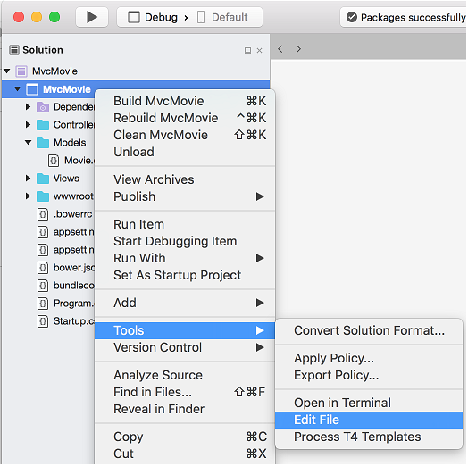

# Add a model to an ASP.NET Core MVC app with Visual Studio for Mac

[!INCLUDE [adding-model](../../includes/mvc-intro/adding-model1.md)]

* Right-click the *Models* folder, and then select **Add** > **New File**. 
* In the **New File** dialog:

  * Select **General** in the left pane.
  * Select **Empty Class** in the center pain.
  * Name the class **Movie** and select **New**.

Add the following properties to the `Movie` class:

[!code-csharp[](../../tutorials/first-mvc-app/start-mvc/sample/MvcMovie/Models/MovieNoEF.cs?name=snippet_1)]

The `ID` field is required by the database for the primary key.

Build the project to verify you don't have any errors. You now have a **M**odel in your **M**VC app.

## Prepare the project for scaffolding

- Right click on the project file, and then select **Tools > Edit File**.

  

- Add the following highlighted NuGet packages to the *MvcMovie.csproj* file:
             
  [!code-csharp[](../first-mvc-app-xplat/start-mvc/sample/MvcMovie/MvcMovie.csproj?highlight=7,10)]

- Save the file.

- Create a *Models/MvcMovieContext.cs* file and add the following `MvcMovieContext` class:
   [!code-csharp[](../../tutorials/first-mvc-app-xplat/start-mvc/sample/MvcMovie/Models/MvcMovieContext.cs)]
   
- Open the *Startup.cs* file and add two usings:
   [!code-csharp[](../../tutorials/first-mvc-app-xplat/start-mvc/sample/MvcMovie/Startup.cs?name=snippet1&highlight=1,2)]

- Add the database context to the *Startup.cs* file:

   [!code-csharp[](../../tutorials/first-mvc-app-xplat/start-mvc/sample/MvcMovie/Startup.cs?name=snippet2&highlight=6-7)]

  This tells Entity Framework which model classes are included in the data model. You're defining one *entity set* of Movie objects, which will be represented in the database as a Movie table.

- Build the project to verify there are no errors.

## Scaffold the MovieController

Open a terminal window in the project folder and run the following commands:

```
dotnet restore
dotnet aspnet-codegenerator controller -name MoviesController -m Movie -dc MvcMovieContext --relativeFolderPath Controllers --useDefaultLayout --referenceScriptLibraries 
```
If you get the error `No executable found matching command "dotnet-aspnet-codegenerator", verify`:

 * You are in the project directory. The project directory has the *Program.cs*, *Startup.cs* and *.csproj* files.
 * Your dotnet version is 1.1 or higher. Run `dotnet` to get the version.
 * You have added the `<DotNetCliToolReference>` element to the [MvcMovie.csproj file](#prepare-the-project-for-scaffolding).
 
<!--
> [!NOTE]
> If you get an error when the scaffolding command runs, see [issue 444 in the scaffolding repository](https://github.com/aspnet/scaffolding/issues/444) for a workaround.
-->

The scaffolding engine creates the following:

* A movies controller (*Controllers/MoviesController.cs*)
* Razor view files for Create, Delete, Details, Edit and Index pages (*Views/Movies/\*.cshtml*)

The automatic creation of [CRUD](https://wikipedia.org/wiki/Create,_read,_update_and_delete) (create, read, update, and delete) action methods and views is known as *scaffolding*. You'll soon have a fully functional web application that lets you manage a movie database.

### Add the files to Visual Studio

* Add the *MovieController.cs* file to the Visual Studio project:

  * Right-click on the *Controllers* folder and select **Add > Add Files**.
  * Select the *MovieController.cs* file.

* Add the *Movies* folder and views:

  * Right-click on the *Views* folder and select **Add > Add Existing Folder**.
  * Navigate to the *Views* folder, select *Views\Movies*, and then select **Open**.
  * In the **Select files to add from Movies** dialog, select **Include All**, and then **OK**.

[!INCLUDE [adding-model 2x](../../includes/mvc-intro/adding-model2xp.md)]

[!INCLUDE [adding-model](../../includes/mvc-intro/adding-model3.md)]

You now have a database and pages to display, edit, update and delete data. In the next tutorial, we'll work with the database.

## Additional resources

* [Tag Helpers](xref:mvc/views/tag-helpers/intro)
* [Globalization and localization](xref:fundamentals/localization)

> [!div class="step-by-step"]
> [Previous Adding a View](adding-view.md)
> [Next Working with SQL](working-with-sql.md)  
